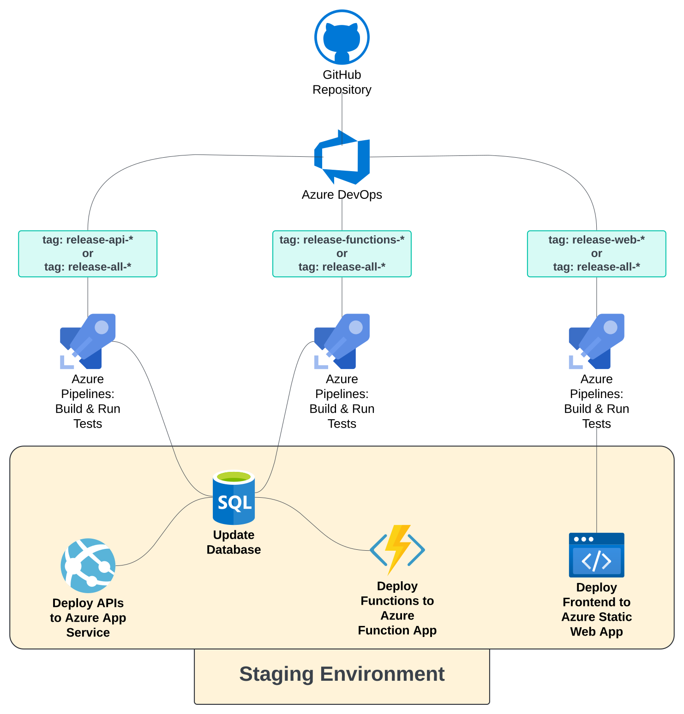
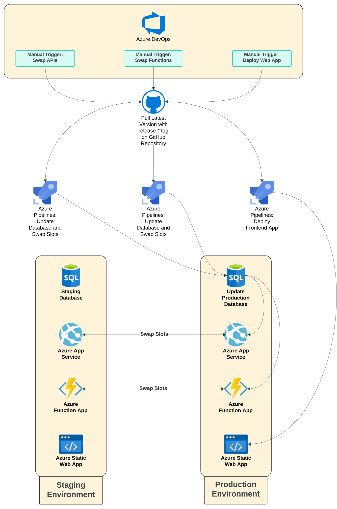

Each Microservice from the ADP is deployed using the following deployment pipelines:

## Staging Environment
Developers can deploy new versions of a microservice to the staging environment as shown in the diagram below.

You can see from the diagram that the staging deployment pipelines are triggered when a commit is tagged in the following format:

- **release-all-***: Deploys all components of the Microservice to the staging environment.
- **release-api-***: Deploys only the API component of the Microservice to the staging environment.
- **release-web-***: Deploys only the Web component of the Microservice to the staging environment.
- **release-functions-***: Deploys only the Functions component of the Microservice to the staging environment.

## Production Environment
Production deployment pipelines are manually triggered by a developer. A developer can swap the staging environment with the production environment as shown in the diagram below.

