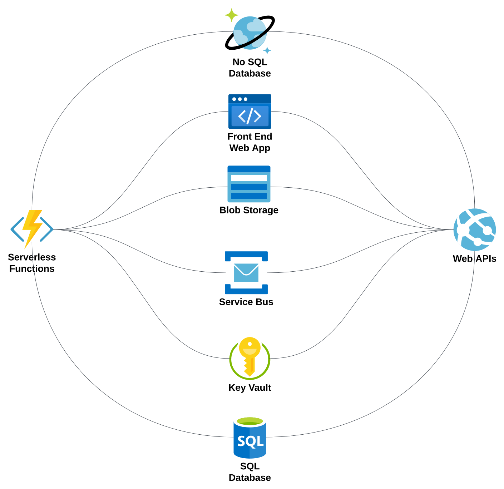

The ADP consists of multiple systems that are distributed as Microservices developed using Microsoft's [.NET 8](https://dotnet.microsoft.com/en-us/).

## Microservices Architecture
Each Microservice is designed using the following architecture:

### SQL Database
Each Microservice has its own SQL Server Database. The SQL Database ensures exeptional data integrity as it's ACID compliant.

!!! success "Cloud Resources"
	Two [Azure SQL Databases](https://azure.microsoft.com/en-us/products/azure-sql/database) are used (for **Production** & **Staging**) by each Microservice.

### Web API
A RESTful Web API developed using .NET 8 that's responsible for handling all incoming requests from the web app dashboard. 

The Web APIs are not being consumed by external clients. For external clients, Serverless Function APIs are used.

!!! success "Cloud Resources"
	An [Azure App Service](https://azure.microsoft.com/en-us/products/app-service) with two slots (for **Production** & **Staging**) are used to host the Web APIs App of each Microservice.

### Serverless Functions
Serverless Function APIs are used to expose APIs to external clients. Typically serving data that are stored in the NoSQL Database.  

Serverless Functions are also used to handle background tasks and scheduled jobs.

!!! success "Cloud Resources"
	An [Azure Functions App](https://azure.microsoft.com/en-us/products/functions) with two slots (for **Production** & **Staging**) are used to host the Serverless Functions of each Microservice.

### Key Vault
Key Vault is used to store and manage application secrets such as connection string, API Keys, passwords, tokens, certificates, and any other sensetive information.  

All the cloud resources are configured to access the Key Vault for secrets instead of storing them in configuration files or environment variables.

!!! success "Cloud Resources"
	An [Azure Key Vault](https://azure.microsoft.com/en-us/products/key-vault) is used for all the Microservices.

### Service Bus
Service Buses are used to decouple the Microservices and enable asynchronous communication between them.

!!! success "Cloud Resources"
	Two [Azure Service Buses](https://azure.microsoft.com/en-us/products/service-bus) are used for all the Microservices.

### Blob Storage
Blob Storage is used to store large files such as images, videos, and documents.

!!! success "Cloud Resources"
	One or more [Azure Blob Storage](https://azure.microsoft.com/en-us/products/storage/blobs) accounts are used for all the Microservices.

### Frontend Web App
The Frontend Web App is a dashboard used for managing the data related to the Microservices.

!!! success "Cloud Resources"
	An [Azure Static Web App](https://azure.microsoft.com/en-us/products/app-service/static) with two slots (for **Production** & **Staging**) are used to host the Frontend Web App of each Microservice.

### NoSQL Database
Some data from the SQL Database is replicated to the NoSQL Database.   

The NoSQL database acts as a shared layer between the Microservices that need to communicate with each other.  
It's also used by the Serverless Functions to serve data to external clients without the need to access the SQL Database.

!!! success "Cloud Resources"
	Two or more [Azure Cosmos DBs](https://azure.microsoft.com/en-us/products/cosmos-db) are used (for **Production** & **Staging**) shared by all the Microservices.