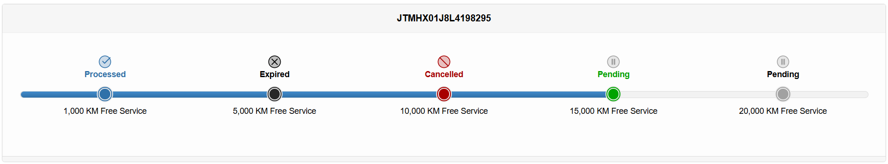

Most Authorized Vehicles are usually sold with certain free services included. These services may vary depending on a number of factors and they are constantly subject to change. 

After activation, the service items can be claimed within a certain time window and the claiming dealer is reimbursed by the distributor.

In addition to standard free service items, additional items belonging to various campaigns can be rewarded to vehicles. These items can come in the form of free services or discount vouchers that can be claimed in a similar way.

In General, Claimable Items are any benefits, services, or offers associated with a vehicle that can be claimed by its owner. These items are often used to incentivize service visits or customer engagement. They may include:

- **Free Services** (such as 1,000 KM or 5,000 KM maintenance)
- **Paid Services** (such as Extended Warranty)
- **Service Campaign Items** (such as vouchers, event rewards, or loyalty-based incentives)

The eligibility and claiming logic for all these items is unified under the Claimable Items framework.

## Claimable Item Types

### Free Services

Most Authorized vehicles come with a set of Free Services as part of their warranty package. These services vary based on several factors and are subject to frequent change.

### Paid Services
Similar to Free Services, Paid Services can also be assigned to vehicles. These are usually purchased by customers, for example to activate an Extended Warranty on either Authorized or Unauthorized vehicles.

### Service Campaign Items
In addition to Free and Paid Services, Service Campaign Items may be rewarded to vehicles based on specific events or conditions. These may include:

- The vehicle is brought in for certain services or inspections.
- The vehicle is converted to special-purpose public/private vehicles (Taxi, Ambulance, Traffice Police, ...etc)
- The vehicle owner participates in a survey.
- The vehicle owner attends a special event.
- Loyalty Criteria (e.g., number of visits or service spend on the vehicle).

Service Campaign Items can be Free or Discount-based and they may be provided as vouchers or other forms of rewards. 

## Claimable Item Management

The distributor maintains a central registry of all Claimable Items in the Services database.
The following parameters define the eligibility and availability of each Claimable Item:

|Parameter|Description|
|-----------------------------------|-------------------------------------------------------------------------------------------------------------------------------------------|
|Item Type                          |	Free / Paid / Campaign                                                                                                                  |
|Validity Period	                |   The duration after activation during which the item can be claimed. Rolling expiry logic is applied when multiple items are eligible    |                  
|Campaign Start/End Date	        |   The period during which the item can be rewarded to a vehicle. Different from Validity Period.                                          |
|Maximum Kilometerage	            |   Max KM on which the item can be claimed. Also used in sequencing items during the rolling expiry evaluation.                            |
|Country                            |   Item availability can be limited by country.                                                                                            |
|Company                            |   Item availability can be limited to specific dealers.                                                                                   |
|Distributor / Dealer Contribution	|   Cost-sharing ratio for Free/Campaign items. Must total 100%. Example: 30% / 70%.                                                        |
|Models	                            |   Katashiki or Variant codes (wildcard supported). E.g., TGN121L- targets all variants starting with that prefix.                         |
|Brand	                            |   For example: Toyota, Lexus, Daihatsu ...etc                                                                                             |

Detailed Parameter Descriptions:

### Item Type
Defines the classification of the item:

- **Free:** Included by default with the vehicle.
- **Paid:** Purchased separately by the customer.
- **Campaign:** Granted based on specific service campaigns.

### Validity Period

The duration during which the item is valid **after activation.**  
Supports **rolling expiry logic** - the next service item's activation is based on the previous service's expiry date (Sequencing is done based on the `Maximum Kilometerage`).

**Example:**
If a vehicle is sold on 2025-01-01:

- 5,000 KM service (2 months validity) expires on 2025-03-01
- 10,000 KM service (3 months validity) expires on 2025-06-01

### Campaign Start / End Date
The period during which the item is **granted to the vehicle** - typically used for campaigns or limited-time offers.   
Unlike the Validity Period, this controls when the item becomes available, not how long it stays claimable.

**Example:**  
If a Free Service campaign runs from **2025-01-01** to **2025-01-07** and has a Validity Period of **3 months**, only vehicles invoiced during this week will receive the item - then the customer can claim it within the next **3 months**.

### Maximum Kilometerage
The maximum odometer reading at which the item can be claimed.   
Also used for sequencing items during the rolling expiry evaluation.

### Country
Claimable Items can be restricted by country to account for regional service programs or operational differences.

### Company
Restricts the item to specific dealers.
Useful when a service is only available (offered) at selected service centers.

### Distributor / Dealer Contribution
Specifies how the cost of Free or Campaign items is split between the distributor and the dealer. Both values must add up to 100%.   
This is used for reimbursing dealers for the free service items that are claimed at their facilities.  

**Examples:**   

- Distributor 100% / Dealer 0%
- Distributor 30% / Dealer 70%
- Distributor 0% / Dealer 100%

### Models
Specifies which vehicle models the item applies to, using Katashiki or Variant codes.
Supports wildcard matching to group similar katashiki/variants under one pattern.

**Example:**  
TGN121L- matches any variant starting with that prefix, such as:

- TGN121L-DTTHKV
- TGN121L-DTMSKV
- TGN121L-BTMSKV

In addition to targeting, this parameter is also used to define the **item cost per model.**
The same service may have different costs depending on the model - e.g., a 5,000 KM service for a `Hilux` will typically cost less than the same service for a `Land Cruiser`.

### Brand
Specifies the vehicle brand(s) applicable to the item.

**Example:**

- Toyota
- Lexus
- Daihatsu
- Hino

## Claimable Item Eligibility & Claiming
Eligible claimable items for a given vehicle is determined from two data sources:

### Persistent Store
Items that are explicitly recorded and associated with a vehicle in the persistent store:

* **Paid Items**: When a `Paid Service` item is purchased. It's pushed to the VIN and stored persistently. Modifying the Claimable Item parameters or removing the item from the `Services Database` will not affect the items that are already pushed to a VIN.
* **Claimed Items**: When an item is claimed, it's also stored persistently.

### Dynamic Evaluation
Evaluates Free Services and Service Campaign Items at runtime during a VIN lookup, ensuring up-to-date results based on current rules and data.

!!! note "Dynamic Evaluation"
    This real-time process ensures that new or corrected data (e.g., pricing updates or backdated campaigns) become effective immediately after the parameters are updated in the Services database.
    
#### Eligibility Evaluation Flow

1. Extract all eligible items for the vehicle in accordance with the parameters set on the service database.
2. Load all items for the givine vehilce from the persistent store.
3. Mark any claimed item as `Claimed`. 
3. Calculate the rolling expiry date for each eligible item and mark expired items as `Expired`.
4. Mark items as `Cancelled` if a subsequent item is claimed before the current item is expired.
5. Remaining items are marked as `Pending` and are available for claiming.

### Service Item Claiming
Claiming is done via the Vehicle Lookup feature in the Hub.

- A unified view displays all claimable items, including Free, Paid, and Campaign-related.
- Each item shows its type, expiry, and claim status.
- Claiming an item requires attaching a service invoice - either scanned from a QR code or entered manually.
