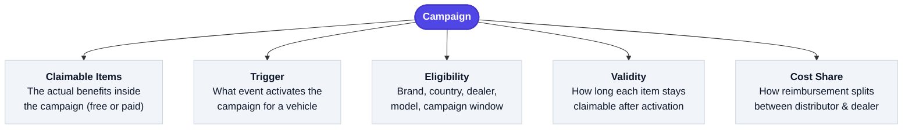
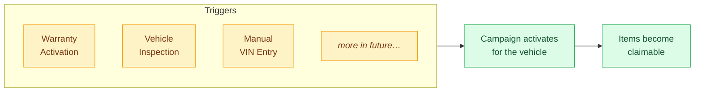
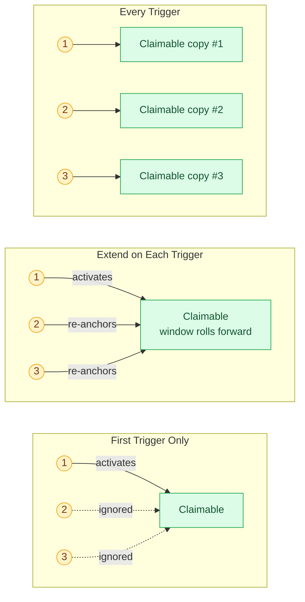
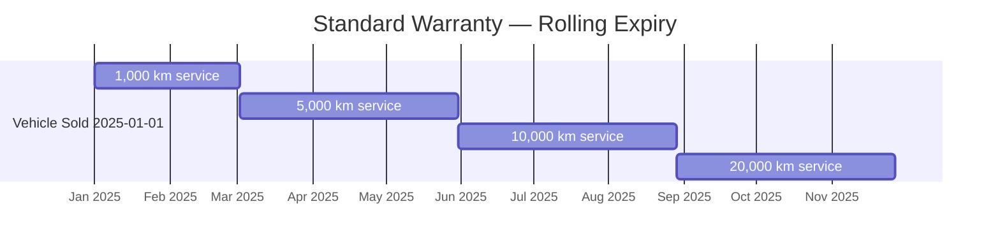
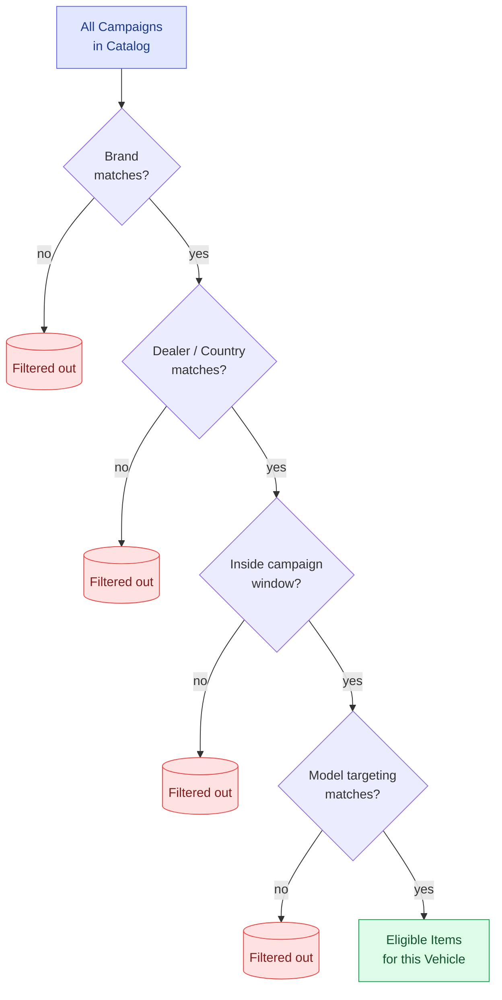
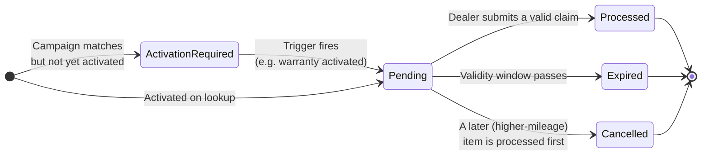
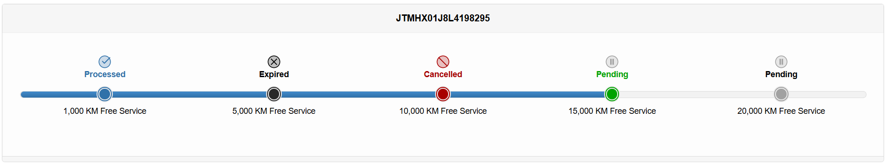
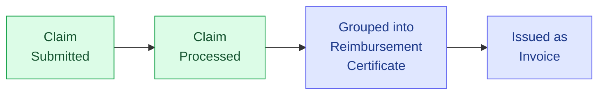

# Claimable Items

A unified framework for any benefit, service, or offer associated with a vehicle that can be claimed by its owner.

Most authorized vehicles are sold with certain free services included. These services vary by brand, model, country, and dealer, and they are continuously subject to change. After activation, each service can be claimed within a configured window, and the claiming dealer is reimbursed by the distributor.

Beyond standard free services, claimable items also cover **paid** services (e.g. Extended Warranty), **promotional rewards**, **loyalty incentives**, and **one-off offers** tied to specific events. The eligibility, activation, expiry, and claiming logic for every kind is unified under a single model.

---

## Everything is a Campaign

The central concept is the **Campaign**. Every claimable item — including the standard warranty package — belongs to one. A campaign defines *who* qualifies, *when* it activates, *how long* it stays claimable, and *how* the cost is split.

```mermaid
flowchart TB
    C(["<b>Campaign</b>"])
    C --> I["<b>Claimable Items</b><br/>The actual benefits inside<br/>the campaign (free or paid)"]
    C --> T["<b>Trigger</b><br/>What event activates the<br/>campaign for a vehicle"]
    C --> E["<b>Eligibility</b><br/>Brand, country, dealer,<br/>model, campaign window"]
    C --> V["<b>Validity</b><br/>How long each item stays<br/>claimable after activation"]
    C --> S["<b>Cost Share</b><br/>How reimbursement splits<br/>between distributor & dealer"]
    classDef root fill:#4f46e5,color:#fff,stroke:#4338ca,stroke-width:2px
    classDef facet fill:#f1f5f9,color:#0f172a,stroke:#cbd5e1
    class C root
    class I,T,E,V,S facet
```

This model lets the same machinery handle very different scenarios — standard maintenance, paid extended warranty, post-inspection rewards, event participation prizes — without bespoke logic per scenario.

### Examples of campaigns

| Example | Items | Trigger | Validity |
|---------|-------|---------|----------|
| **Standard Warranty Maintenance** | 1K, 5K, 10K, … km free services | Warranty activation | Rolling — each service activates when the previous expires |
| **Extended Warranty** | Paid coverage line | Customer purchase | Fixed window from purchase to expiry |
| **Inspection-Based Reward** | Free check-up service | A specific inspection is performed | Months from the inspection date |
| **Event Participation** | Discount voucher | Admin records the VIN against the campaign | Calendar window |
| **Loyalty Incentive** | Free service | Admin records VIN after N visits | Months from being granted |

---

## What's Inside a Campaign

### Claimable Items

Each campaign contains one or more **Claimable Items** — the actual benefits the customer receives. Items can be:

- **Free** — included by virtue of the campaign (warranty bundle, promotional reward, etc.).
- **Paid** — explicitly purchased by the customer. Once purchased, a paid item is pushed to the VIN and stored permanently; subsequent changes to the catalog never affect items already pushed.

Each item carries its own metadata: name, printout title, description, mileage cap, package code (used downstream on the invoice and job sheet), and a cost — either a fixed cost or a per-model cost keyed by Katashiki or Variant.

!!! info "Per-model cost"
    A single item (say, a 5,000 km service) can have different costs by model — typically prefix-matched on the Katashiki or Variant. For example, `TGN121L-` matches every variant starting with that prefix. The distributor configures one item; the model-specific costs flow from it.

### Triggers (examples)

A trigger is **what event causes a campaign to activate** for a particular vehicle. The framework treats triggers as a pluggable list — new triggers can be added without disrupting the rest of the model. The currently supported triggers are:

- **Warranty Activation** — the default. The campaign activates when the vehicle's warranty is activated. The standard maintenance bundle uses this trigger.
- **Vehicle Inspection** — the campaign activates when the vehicle undergoes a specific inspection. Used today for inspection-based rewards. *This trigger may be generalized into Manual VIN Entry in the future, as the two have similar shapes.*
- **Manual VIN Entry** — an administrator explicitly records the VIN against the campaign. Used for event rewards, surveys, loyalty incentives, and other one-off cases that don't fit a system event.

```mermaid
flowchart LR
    subgraph Triggers
      direction TB
      T1[Warranty<br/>Activation]
      T2[Vehicle<br/>Inspection]
      T3[Manual<br/>VIN Entry]
      T4[<i>more in future…</i>]
    end
    Triggers --> A[Campaign activates<br/>for the vehicle]
    A --> P[Items become<br/>claimable]
    classDef trig fill:#fef3c7,color:#78350f,stroke:#f59e0b
    classDef step fill:#dcfce7,color:#14532f,stroke:#16a34a
    class T1,T2,T3,T4 trig
    class A,P step
```

### Repeated Triggers

When a trigger event can recur (for example, a vehicle can have many inspections), the campaign declares how repeats are handled:

- **First Trigger Only** — the first occurrence activates the campaign; later ones are ignored. One-time benefit.
- **Extend on Each Trigger** — the activation date is *re-anchored* on each occurrence, so the claim window keeps rolling forward. Renewable benefit.
- **Every Trigger** — each occurrence emits its own claimable copy of the item, independently claimable. Repeatable benefit.

```mermaid
flowchart LR
    subgraph First["First Trigger Only"]
      direction LR
      F1((1)) -->|activates| F2[Claimable]
      F3((2)) -.->|ignored| F2
      F4((3)) -.->|ignored| F2
    end
    subgraph Extend["Extend on Each Trigger"]
      direction LR
      E1((1)) -->|activates| EX[Claimable<br/>window rolls forward]
      E2((2)) -->|re-anchors| EX
      E3((3)) -->|re-anchors| EX
    end
    subgraph Every["Every Trigger"]
      direction LR
      V1((1)) --> V2[Claimable copy #1]
      V3((2)) --> V4[Claimable copy #2]
      V5((3)) --> V6[Claimable copy #3]
    end
    classDef ev fill:#fef3c7,color:#78350f,stroke:#f59e0b
    classDef cl fill:#dcfce7,color:#14532f,stroke:#16a34a
    class F1,F3,F4,E1,E2,E3,V1,V3,V5 ev
    class F2,EX,V2,V4,V6 cl
```

Not every combination is meaningful — warranty activation by its nature only happens once, so the standard warranty campaign always uses *First Trigger Only*.

### Validity & Expiry

A campaign's items become claimable on activation and stay claimable until they expire. There are two validity styles:

- **Relative to activation** — the most common. Each item is claimable for a configurable duration (days / weeks / months / years) after activation. This is the style used by the standard warranty bundle.
- **Fixed calendar range** — the item is claimable only between two specific dates, independent of when it was activated. Useful for time-bound promotions.

For warranty bundles, the items use **rolling expiry** — each service in the sequence activates when the previous one expires. Mileage caps determine the order.

```mermaid
gantt
    title Standard Warranty — Rolling Expiry
    dateFormat YYYY-MM-DD
    axisFormat %b %Y
    section Vehicle Sold 2025-01-01
    1,000 km service     :a1, 2025-01-01, 60d
    5,000 km service     :a2, after a1, 90d
    10,000 km service    :a3, after a2, 90d
    20,000 km service    :a4, after a3, 90d
```

The customer sees one window opening as the previous one closes — a simple, predictable progression.

### Eligibility

A campaign declares **who qualifies** at the catalog level: brand, country, dealer (company), the campaign's own start/end window for when items can be granted, and optional model targeting (Katashiki / Variant prefix). When a vehicle is looked up, the framework filters the catalog down to the items that match.

```mermaid
flowchart TB
    A[All Campaigns<br/>in Catalog] --> B{Brand<br/>matches?}
    B -->|no| X1[(Filtered out)]
    B -->|yes| C{Dealer / Country<br/>matches?}
    C -->|no| X2[(Filtered out)]
    C -->|yes| D{Inside campaign<br/>window?}
    D -->|no| X3[(Filtered out)]
    D -->|yes| E{Model targeting<br/>matches?}
    E -->|no| X4[(Filtered out)]
    E -->|yes| F[Eligible Items<br/>for this Vehicle]
    classDef pass fill:#dcfce7,color:#14532f,stroke:#16a34a
    classDef fail fill:#fee2e2,color:#7f1d1d,stroke:#ef4444
    classDef start fill:#e0e7ff,color:#1e3a8a,stroke:#6366f1
    class A start
    class F pass
    class X1,X2,X3,X4 fail
```

### Cost Share

Free and promotional items carry a **distributor / dealer split** that must total 100%. When the dealer claims the item, the split determines who is invoiced and who absorbs which portion. Typical configurations are *100/0* (fully distributor-funded), *0/100* (dealer-funded), or shared (e.g. *30/70*).

---

## Item Lifecycle

Once a claimable item is associated with a vehicle, it moves through a small state machine:

```mermaid
stateDiagram-v2
    direction LR
    [*] --> ActivationRequired: Campaign matches<br/>but not yet activated
    ActivationRequired --> Pending: Trigger fires<br/>(e.g. warranty activated)
    [*] --> Pending: Activated on lookup
    Pending --> Processed: Dealer submits a valid claim
    Pending --> Expired: Validity window passes
    Pending --> Cancelled: A later (higher-mileage)<br/>item is processed first
    Processed --> [*]
    Expired --> [*]
    Cancelled --> [*]
```

A vehicle's lookup result shows every relevant item, in every state — so a service advisor sees claim history alongside what is still claimable.

### Why an item might be Cancelled

If a vehicle skips a milestone — say, the customer goes straight to the 10,000 km service and skips the 5,000 km service — the framework automatically marks the skipped item as **Cancelled** rather than leaving it visible as Pending. The history stays honest without manual cleanup.

---

## Per-VIN Overrides

For day-to-day operational corrections, the distributor can apply two per-VIN overrides without touching the catalog:

| Override | Purpose |
|----------|---------|
| **Date Shift** | Re-anchor a specific vehicle's free-service start date. Used to correct miskeyed warranty activation dates or to manually re-anchor a vehicle whose history needs adjustment. |
| **VIN Exclusion** | Strip warranty-activated free items from a specific VIN. Used to revoke standard services for vehicles that should not receive them (e.g. internal fleet, demo cars, edge cases). |

Paid items and inspection / manual-entry items are not affected by exclusions — those follow their own data trail.

### Ineligible-but-claimed items

If a vehicle has a successful claim for an item that *no longer matches* the current eligibility filters (for example, the brand list was changed after the claim happened), the item is still surfaced in the result as **Processed**. The customer- and dealer-facing claim history stays visible through later configuration changes.

---

## Claim Submission & Validation

Claiming is performed via the **Vehicle Lookup** screen — in the dashboard, or via the embedded `<vehicle-warranty-details>` web component.

Each item declares:

- **Claiming Method** — by **QR code** scan, or by manually entering **Invoice + Job Number**.
- **Attachment Behavior** — whether an invoice attachment is **hidden**, **optional**, or **required** at claim time.

Every item returned by the framework carries a short-lived **signed token** stamped at lookup time. When the dealer submits a claim, the backend re-validates that token. This prevents two failure modes that previously caused reconciliation issues:

- **Stale lookups** — a dealer can't claim an item against a result that was rendered hours ago and is no longer valid.
- **Tampering** — claim payloads can't be hand-edited to bypass mileage caps or expiry checks.

A successful claim writes a permanent claim record and the item flips to **Processed** on every subsequent lookup.

---

## Reimbursement Flow

After a claim is processed, the claim becomes eligible for reimbursement. The distributor periodically groups claims into **Reimbursement Certificates** — one per company per period — and then issues an **Invoice** stamped with an invoice date. This is the dealer's settlement workflow.

```mermaid
flowchart LR
    A[Claim<br/>Submitted] --> B[Claim<br/>Processed]
    B --> C[Grouped into<br/>Reimbursement<br/>Certificate]
    C --> D[Issued as<br/>Invoice]
    classDef claim fill:#dcfce7,color:#14532f,stroke:#16a34a
    classDef settle fill:#e0e7ff,color:#1e3a8a,stroke:#6366f1
    class A,B claim
    class C,D settle
```

The cost-share configured on each item determines the line amounts on the certificate.

---

## Dashboard Surface

The distributor's setup and operational dashboard typically exposes:

- **Campaigns** — the umbrella entity carrying name, dates, brands / countries / companies, trigger, and repeat behaviour.
- **Claimable Items** — the per-item catalog editor (name, printout fields, mileage cap, claiming method, attachment behaviour, validity, costing).
- **Vehicle Lookup** — the per-VIN screen where dealers view and claim items, backed by the `<vehicle-warranty-details>` web component, with optional `<vin-extractor>` for camera-based VIN scanning.
- **Service Activation** — the form for pushing paid services (e.g. Extended Warranty) onto a VIN, capturing customer profile and invoice context.
- **Item Claims** — claim list and detail, including the distributor-side status workflow (accept, reject, flag, certify).
- **Reimbursement Certificates & Invoices** — the settlement workflow described above.
- **Date Shifts** and **VIN Exclusions** — operational overrides.
- **Campaign VIN Entries** — admin entries for *Manual VIN Entry* campaigns.
- **Vehicle Inspection setup** *(where the Vehicle Inspection trigger is in use)* — inspection types and forms that drive inspection-activated campaigns.

---

## Related Reference

- BDD specs — [Service Items feature suite](../../generated/Features/ServiceItems.md): the live, runnable behaviour contract.
- DTO — [`VehicleServiceItemDTO`](../../generated/LookupServices/DTOsAndModels/VehicleLookup/VehicleServiceItemDTO.md).
- Catalog — [`ServiceItemModel`](../../generated/Models/Vehicle/ServiceItemModel.md), [`ServiceItemCostModel`](../../generated/Models/Vehicle/ServiceItemCostModel.md).
- Claim — [`ItemClaimModel`](../../generated/Models/Vehicle/ItemClaimModel.md).
- Per-VIN overrides — [`FreeServiceItemDateShiftModel`](../../generated/Models/Vehicle/FreeServiceItemDateShiftModel.md), [`FreeServiceItemExcludedVINModel`](../../generated/Models/Vehicle/FreeServiceItemExcludedVINModel.md).
- Paid — [`PaidServiceInvoiceModel`](../../generated/Models/Vehicle/PaidServiceInvoiceModel.md), [`PaidServiceInvoiceLineModel`](../../generated/Models/Vehicle/PaidServiceInvoiceLineModel.md).
- Enums — [Validity Mode](../../generated/Models/Enums/ClaimableItemValidityMode.md), [Activation Triggers](../../generated/Models/Enums/ClaimableItemCampaignActivationTriggers.md), [Activation Types](../../generated/Models/Enums/ClaimableItemCampaignActivationTypes.md), [Claiming Method](../../generated/Models/Enums/ClaimableItemClaimingMethod.md), [Attachment Behavior](../../generated/Models/Enums/ClaimableItemAttachmentFieldBehavior.md), [Statuses](../../generated/LookupServices/Enums/VehcileServiceItemStatuses.md), [Types](../../generated/LookupServices/Enums/VehcileServiceItemTypes.md).
