# Warranty System

The warranty system manages **manufacturer warranty claims** from end to end — from the moment a dealer performs a warranty repair, through review and settlement by the distributor, all the way to reimbursement by the manufacturer. It is the hub that connects the three parties of an authorized distribution network.

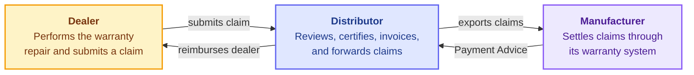

The system runs two settlement legs back to back: **dealer ↔ distributor** (the distributor reimburses the dealer for approved repairs) and **distributor ↔ manufacturer** (the manufacturer reimburses the distributor once the claims are processed on its side).

!!! info "The parties"
    - **Customer** — the vehicle owner, who receives the warranty repair at no charge.
    - **Dealer** — the authorized service point that carried out the repair and is owed its cost.
    - **Distributor** — owns the warranty program, reviews every claim, and settles with both sides.
    - **Manufacturer** — receives claims through its own warranty system and reimburses the distributor via a **Payment Advice**.

!!! note "Not to be confused with Claimable Items"
    This module covers **manufacturer warranty claims** — repairs against the vehicle's defect warranty, settled in labor / parts / sublet amounts and ultimately reimbursed by the manufacturer. The separate [Claimable Items](../claimable-items.md) module covers **free and paid services** (the standard maintenance bundle, extended warranty, promotions) that the *distributor* reimburses. The two share vocabulary ("claim", "certificate", "invoice") but are distinct pipelines.

---

## The Claim Lifecycle at a Glance

Every warranty claim travels the same six stages. They map one-to-one onto the two settlement legs above.

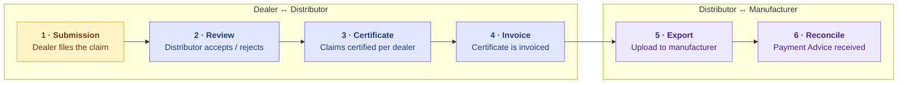

| # | Stage | Driven by | What happens | Claim status after |
|---|-------|-----------|--------------|--------------------|
| 1 | **Dealer Claim Submission** | Dealer | Repair captured as a claim (labor, parts, sublet) and submitted | `Draft` → `Pending` |
| 2 | **Review by Distributor** | Distributor | Claim accepted, bounced back for correction, or rejected | `Accepted` / `Error` / `Rejected` |
| 3 | **Dealer Certificate** | Distributor | Accepted claims grouped onto a per-dealer certificate | `Certified` |
| 4 | **Dealer Invoice** | Distributor | The certificate is invoiced for settlement | `Invoiced` |
| 5 | **Export & Upload to Manufacturer** | Distributor | Claims exported as a manufacturer CSV + invoice | Manufacturer status → `Exported` |
| 6 | **Reconciliation** | Distributor | The manufacturer's Payment Advice imported and matched | Manufacturer status → `Paid` / `Rejected` |

---

## Two Status Tracks

A claim carries **two independent statuses** at all times. Keeping them separate is what lets the dealer↔distributor leg settle before the manufacturer has even seen the claim.

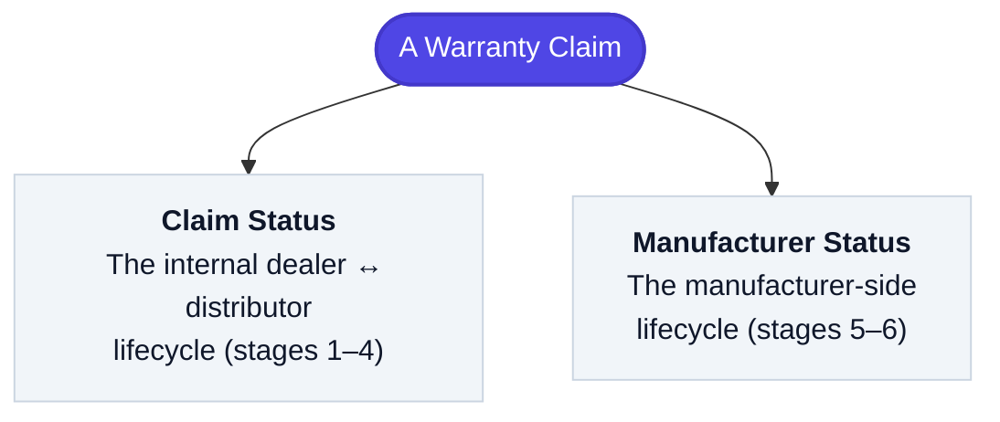

### Claim Status — the internal lifecycle

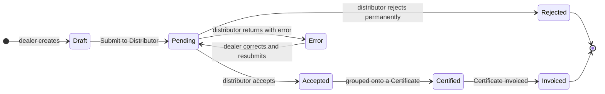

Only **Draft** and **Error** claims are editable by the dealer; once **Certified** or **Invoiced**, a claim is locked. (A distributor-created claim skips `Draft` and starts at `Pending`.)

### Manufacturer Status — the manufacturer lifecycle

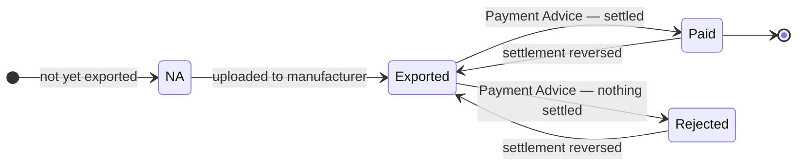

!!! note "Defined but currently unused"
    The manufacturer track also defines **Downloaded** and **On Hold** states for completeness with the manufacturer's system, but the current flow never sets them — claims move straight from `Exported` to `Paid` or `Rejected`.

---

## Stage 1 · Dealer Claim Submission

The dealer captures a completed warranty repair as a claim. Saving creates it as a **Draft** with an auto-generated claim number; **Submit to Distributor** then advances it to **Pending**.

### Anatomy of a claim

A claim is a header (the vehicle, the defect, the dates) plus three kinds of repeating cost lines. The totals roll up automatically from the lines.

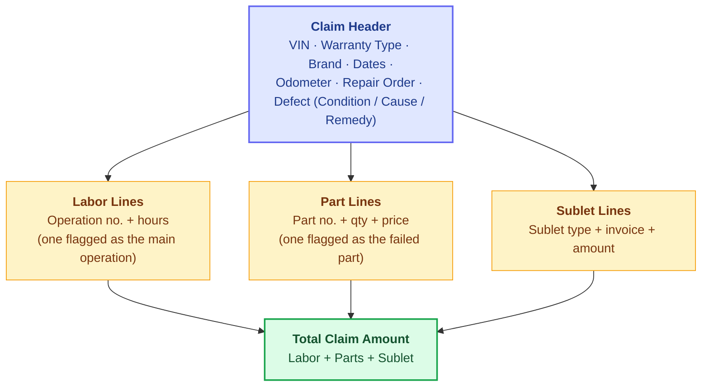

- **Labor** is valued as *hours × labor rate*. Hours auto-fill from the flat-rate catalog by operation code and model year.
- **Parts** are valued as *price × quantity*, with prices resolved from the part-lookup service. Parts are further weighted by the parts reimbursement rate (**PRR**) on the distributor side.
- **Sublet** captures outsourced work (paint, towing, electrical, etc.) as flat amounts.

### Claim categories

Each claim declares a **warranty type** — the category the manufacturer settles it under. A typical configuration covers:

| Category | Covers |
|----------|--------|
| **Vehicle Warranty** | The standard defect warranty on the vehicle |
| **Service Parts Warranty** | Parts replaced during a workshop repair |
| **Counter-Sales Parts Warranty** | Parts sold over the counter |
| **Accessory Warranty** | Fitted accessories |
| **Counter-Sales Accessory Warranty** | Accessories sold over the counter |
| **Campaign** | Recall / field-action work |

The exact set is configurable per distributor. The form adapts to the chosen type — a counter-sales (non-vehicle) type hides the VIN and repair fields, a parts-warranty type captures the previous repair, an accessory type captures the install date and mileage, and a campaign type resolves its campaign code automatically from the labor operations. An orthogonal **Operation Type** (General, Paint, Noise, Rain, Campaign, Dealer / Distributor Stock Disposal) classifies the nature of the work.

### Claim numbering

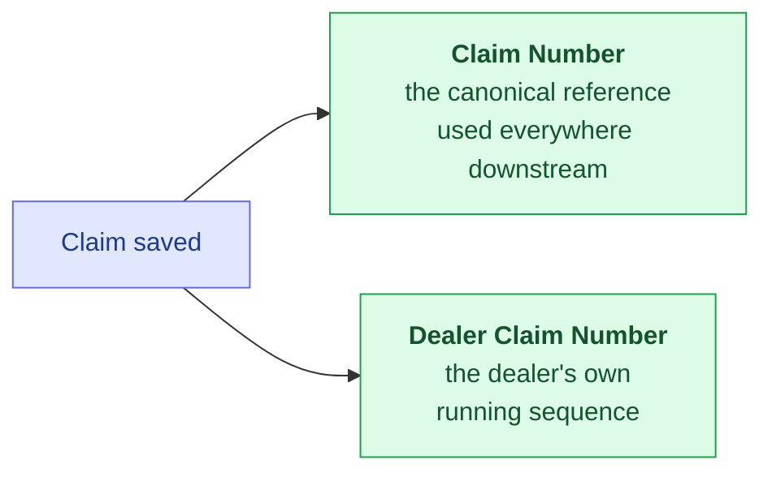

The **Claim Number** is generated from the claim year, a per-dealer code, and a running sequence. It is immutable once assigned and is the key used everywhere downstream — on the certificate, in the manufacturer export, and when matching the Payment Advice.

!!! info "One delivery date per VIN"
    A vehicle's **Delivery Date** is treated as a property of the VIN, not the individual claim — all claims for the same VIN must agree on it. Once any claim for the VIN reaches a *verified* state (Certified, Invoiced, or Manufacturer Paid), the date is locked and propagation can never overwrite it. Editing the date on an unverified claim offers to align its siblings. See the [Warranty Dates](../../../generated/Features/WarrantyDates.md) behavior specs.

---

## Stage 2 · Review by Distributor

The distributor works the queue of **Pending** claims. Review actions are taken on a selection of claims at once and drive the claim status.

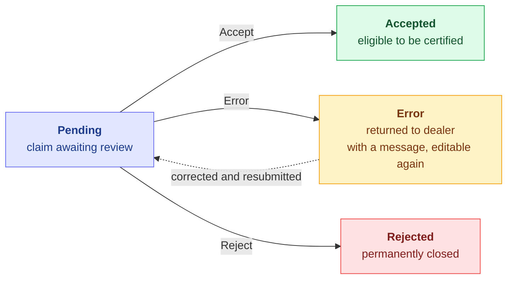

- **Accept** — the claim is sound and ready to be certified.
- **Error** — a correctable problem; the claim is bounced back to the dealer with an **error message** and becomes editable again for resubmission.
- **Reject** — the claim is permanently declined.

While reviewing, the distributor can also adjust the settlement: per-claim **labor / parts / sublet adjustment percentages**, the distributor's own line amounts (distributor-adjusted hours and purchase prices), the parts reimbursement rate, and the settlement-currency exchange rates used later in the export.

---

## Stage 3 · Dealer Certificate

The distributor groups **Accepted** claims into a **Certificate** — the document that certifies a dealer's claims for a billing period and moves them to **Certified**.

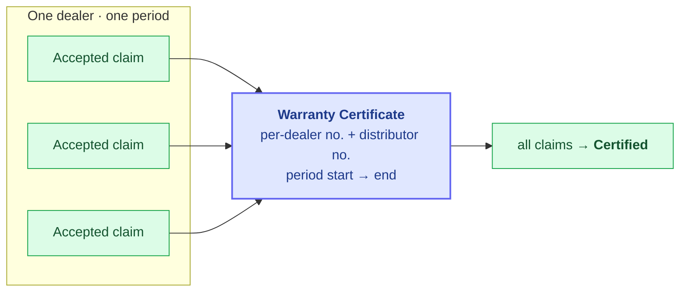

**Grouping rule:** every claim on a certificate must belong to the **same dealer**, and the certificate covers a **period** (defaulting to the previous calendar month). A certificate carries two numbers: a per-dealer running **Certificate Number**, and a **distributor-wide number** that runs per year. Certifying locks the underlying claims; **removing the certificate** reverts them to `Accepted`.

---

## Stage 4 · Dealer Invoice

An **Invoice is a Certificate that has been given an invoice date.** It is the same document — invoicing is the act of stamping an invoice date on an existing certificate, which advances its claims from **Certified** to **Invoiced**.

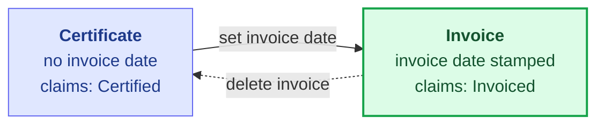

| | **Certificate** | **Invoice** |
|---|------------------|-------------|
| State | No invoice date | Invoice date set |
| Meaning | Claims certified for the period | Claims billed for settlement |
| Claim status it sets | `Accepted` → `Certified` | `Certified` → `Invoiced` |
| Number | Certificate Number + distributor-wide number | Reuses the same number |
| Editable | Yes, until invoiced | No (system-generated) |
| Reversible | Delete → claims back to `Accepted` | Delete → claims back to `Certified` |

Both documents are per-dealer and per-period, and both can be printed. Their totals (labor, parts, sublet, grand total) are summed from the linked claims in local currency.

---

## Stage 5 · Export & Upload to Manufacturer

To bill the manufacturer, the distributor exports a batch of claims to a **CSV in the manufacturer's format** and uploads it to the manufacturer's system. The distributor supplies the **manufacturer invoice number** and the **settlement-currency exchange rates** (parts reimbursement rate, plus labor / parts / sublet rates) at export time.

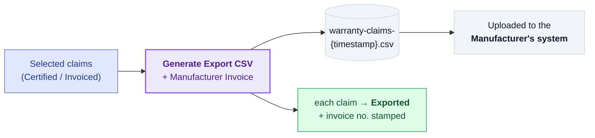

- The export produces a wide, fixed-layout **flat CSV** in the manufacturer's exact column order. Because a single claim can have many lines, it is **paginated** across CSV rows (a fixed number of labor, sublet, and part slots per row), with the header fields repeated on each page.
- A few values are translated for the manufacturer: the brand becomes a numeric code, campaign claims are emitted under the vehicle-warranty type, pre-delivery dates emit a sentinel, and amounts are switched to their settlement-currency equivalents.
- Alongside the CSV, a **manufacturer invoice** (PDF, in the settlement currency, grouped by invoice number) is produced for the same batch.
- Each exported claim's manufacturer status becomes **Exported**. Claims already marked **Paid** cannot be re-exported.

---

## Stage 6 · Reconciliation

After processing the batch, the manufacturer returns a **Payment Advice** — a settlement file stating what it paid (or rejected) per claim. The distributor uploads it as a **Manufacturer Settlement Sheet**, and the system matches each row back to its claim.

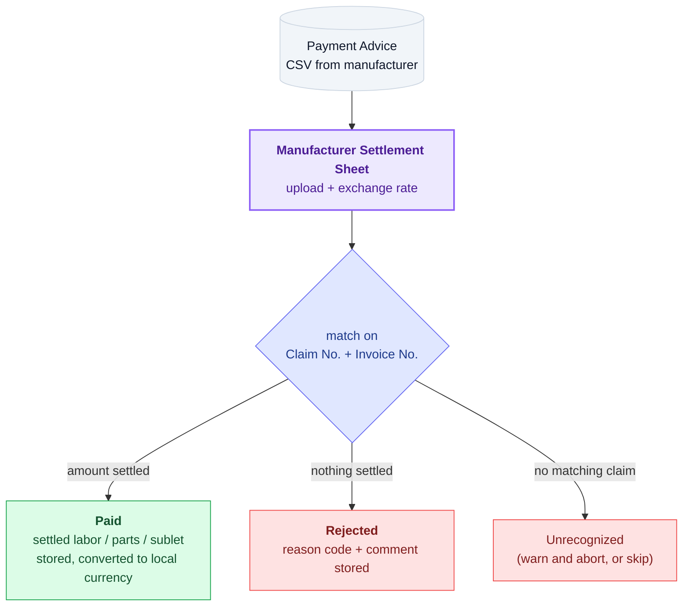

- Only rows the manufacturer marks **Processed** are acted on. Each is matched to a claim on the composite key **Claim Number + Invoice Number**.
- A non-zero settled amount marks the claim **Paid**: the settled labor / parts / sublet amounts (in the settlement currency) are stored and converted to local currency using the sheet's exchange rate. A **partial payment** is simply a lower settled amount on a `Paid` claim — there is no separate status for it.
- A zero settled amount marks the claim **Rejected**, recording the manufacturer's reason code and comment.
- **Unrecognized** claim numbers either abort the whole import with a detailed warning, or are skipped — the operator chooses per upload. A guard also blocks silently overwriting an already-reconciled claim with different amounts.

!!! tip "Reconciliation is reversible"
    Deleting a settlement sheet un-reconciles its claims: the settled amounts are cleared and the claims revert to **Exported**, ready to be reconciled again from a corrected Payment Advice.

---

## Status Reference

### Claim Status

| Value | Display | Meaning |
|------:|---------|---------|
| 0 | **Draft** | Created but not yet submitted |
| 1 | **Pending** | Submitted, awaiting distributor review |
| 2 | **Accepted** | Reviewed and accepted; ready to certify |
| 3 | **Error** | Returned for correction (editable again) |
| 4 | **Rejected** | Permanently rejected |
| 5 | **Certified** | Grouped onto a certificate (locked) |
| 6 | **Invoiced** | Certificate invoiced for settlement (locked) |

### Manufacturer Status

| Value | Display | Meaning |
|------:|---------|---------|
| 0 | **N/A** | Not yet exported |
| 1 | **Exported** | Uploaded to the manufacturer |
| 2 | **Downloaded** | Acknowledged by the manufacturer *(reserved, unused)* |
| 3 | **Paid** | Settled by the manufacturer |
| 4 | **Rejected** | Declined by the manufacturer |
| 5 | **On Hold** | Pending further review *(reserved, unused)* |

---

## Related Reference

- Status enums — [Claim Status](../../../generated/Models/Enums/ClaimStatus.md), [Warranty Manufacturer Claim Status](../../../generated/Models/Enums/WarrantyManufacturerClaimStatus.md).
- Claim model — [`WarrantyClaimModel`](../../../generated/Models/Vehicle/WarrantyClaimModel.md), [`WarrantyClaimLaborLineModel`](../../../generated/Models/Vehicle/WarrantyClaimLaborLineModel.md), [`WarrantyDateShiftModel`](../../../generated/Models/Vehicle/WarrantyDateShiftModel.md).
- Delivery-date behavior — [Warranty Dates BDD specs](../../../generated/Features/WarrantyDates.md).
- The companion free / paid service pipeline — [Claimable Items](../claimable-items.md).
