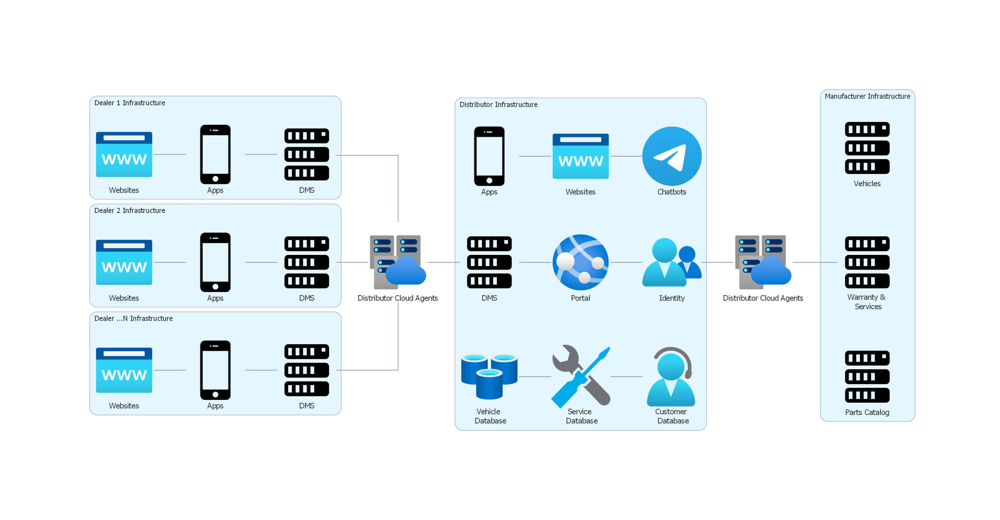
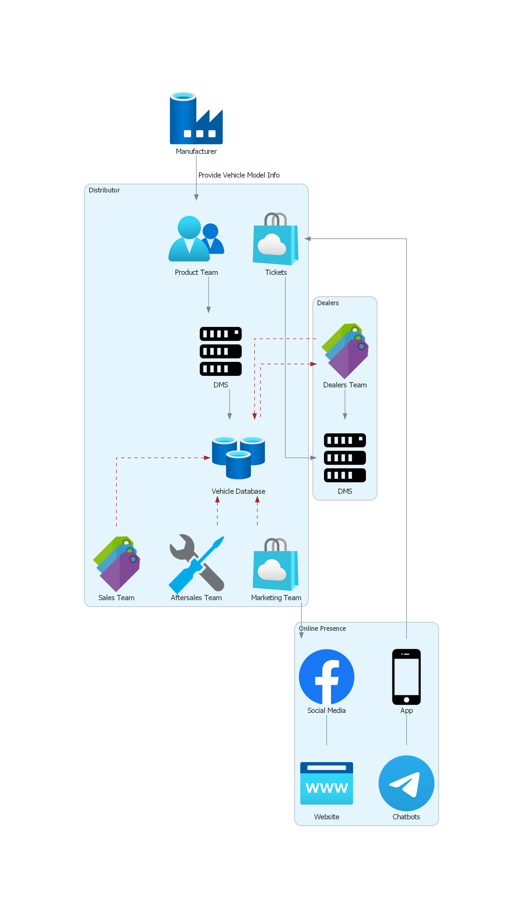
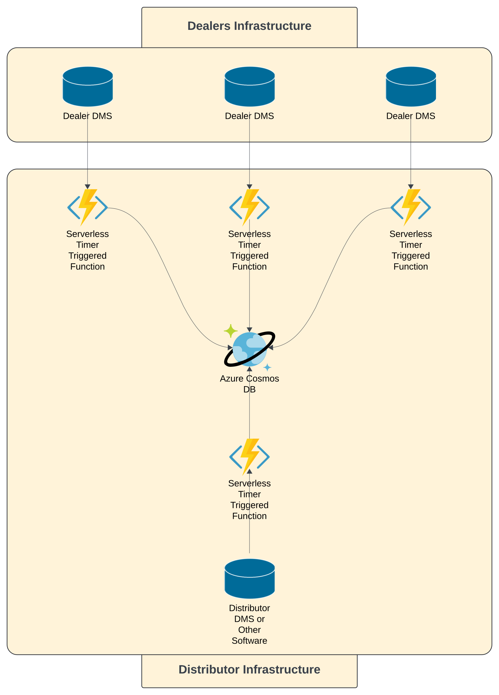

# Vehicle Database
A centralized repository that acts as a single source of truth for all matters related to vehicles, including but not limited to the following:

## Purpose
Automotive distributors are large enterprises with many branches and departments. Being a distributor, they also oversee the operations of many dealers across their network.

Within this expansive structure, a distributor utilizes various platforms that are maintained internally, by dealers themselves, or by third-party developers.

The following graph provides a top-level view of how a distributor may orchestrate the flow of data between its platforms and the external systems used by its dealers and the manufacturer.

## Data Governance
The distributor's role within the network is essentially to apply Data Governance across all entities.  

Data Governance involves managing the availability, usability, consistency, integrity, and security of the data employed in the enterprise.  

By centralizing data, the distributor establishes a single source of truth (SSOT), ensuring that all companies, branches, departments, and platforms operate with the same accurate and up-to-date information.  

This centralization aids in avoiding discrepancies and data silos that can arise when different parts of the organization use separate data sources.

Simultaneously, by decentralizing responsibility, the distributor empowers each entity within its network to independently manage their specific operations. 
This means that while data is centrally unified, the responsibility of utilizing this data for various tasks is distributed to the respective teams and platforms.

## Data Flow Example
A vehicle (or any other entity for that matter) means different things to different teams and platforms.  

The following diagram illustrates how a vehicle entity is seamlessly flowing between different platforms and teams within the distributor network.  

!!! warning "Note"
    The diagram is a simplified representation of the data flow and is only an arbitrary example.   
    Additionally, the vehicle entity here represents a **Vehicle Model** and not an individual vehicle.

In this way, Data Governance at the distributor ensures that data is centrally managed to maintain its quality and reliability, while the operational responsibilities are decentralized to improve efficiency and reduce redundancy.

By adhering to these principles, the distributor maintains a robust data management strategy that supports its diverse and expansive operational needs.

## Vehicle Data Warehousing

Since each dealer (company) has its own DMS (Dealer Management System), a crucial part of the vehicle database is the data warehousing system.  

Data from each dealer's DMS is periodically extracted, transformed, and loaded into the data warehouse.

