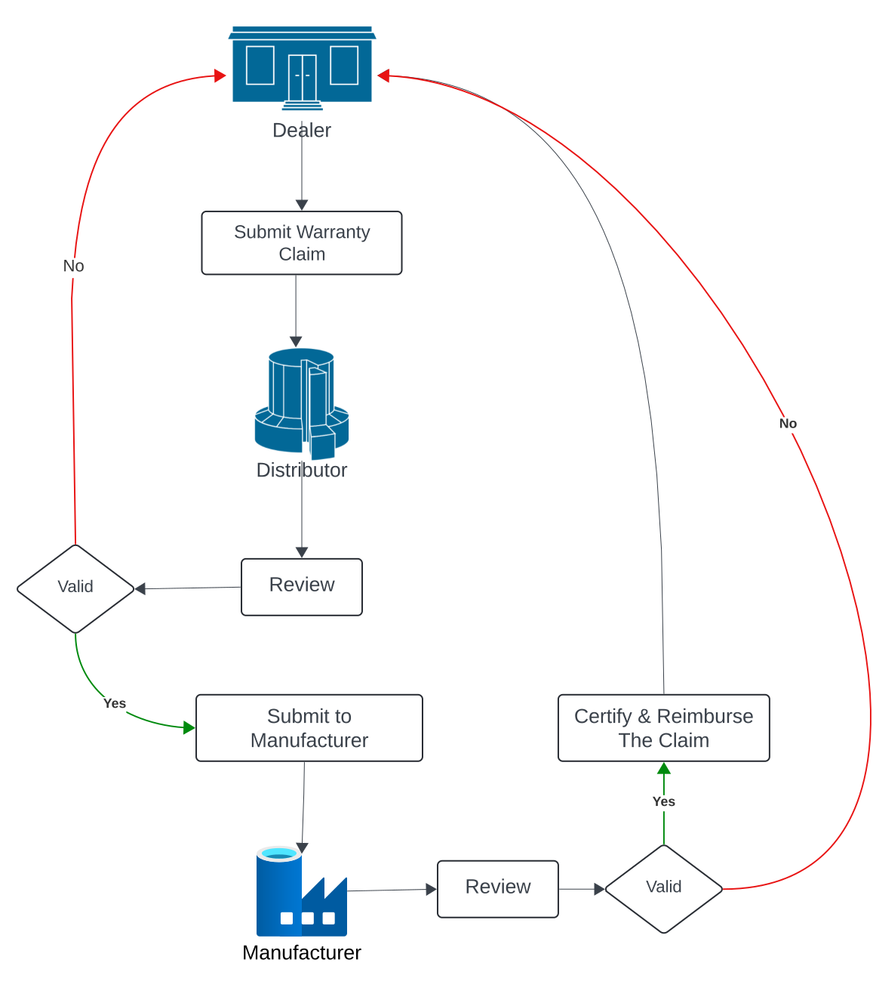

# Warranty System

The warranty system acts as a hub between dealers, the distributor, and the manufacturer.  

It allows dealers to submit warranty claims. The distributor can then review and approve these claims before forwarding them to the manufacturer for final approval.

