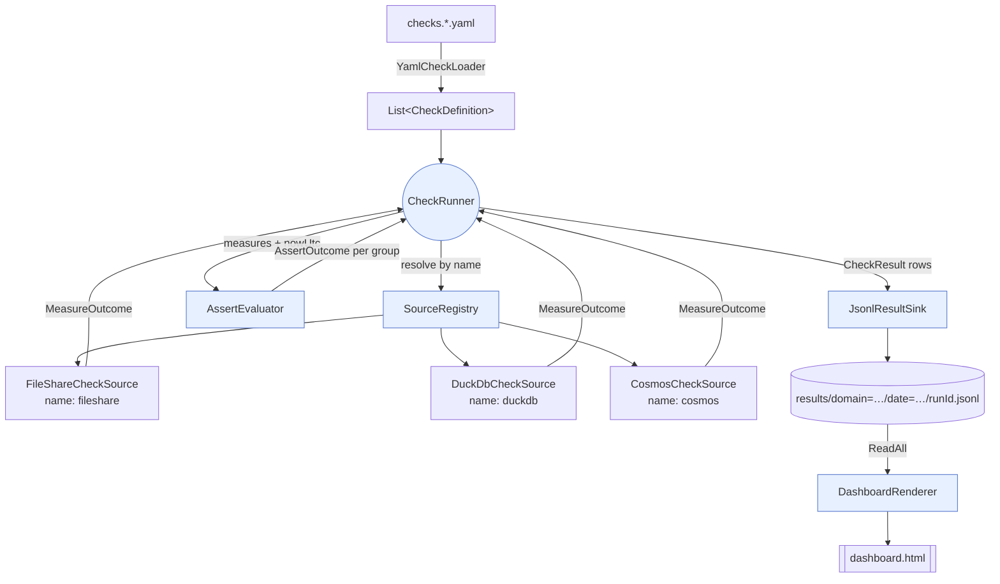
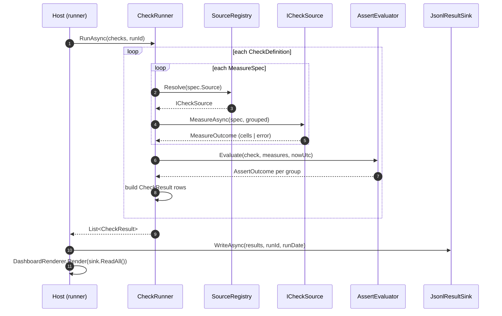
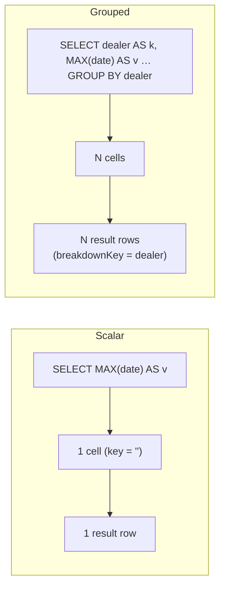
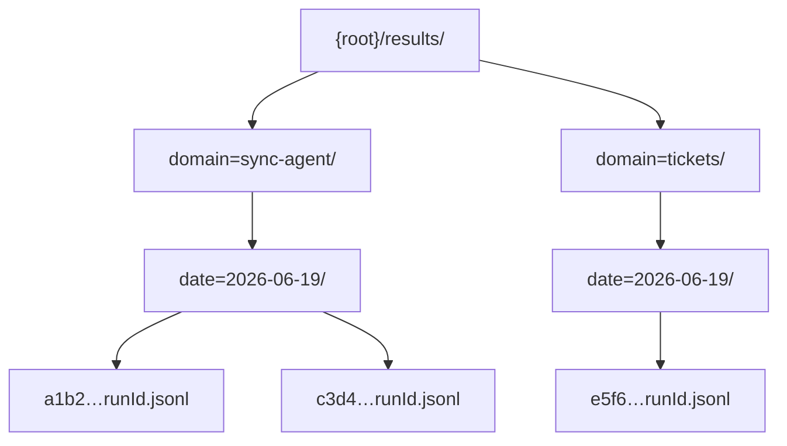

# Architecture

Rastgo is a short pipeline of small, single-purpose pieces: a **runner** drives **check definitions** against **sources**, an **assert engine** turns measured values into verdicts, a **sink** persists the verdicts as rows, and a **renderer** unions those rows into a dashboard. This page walks each piece and the lifecycle that ties them together.

## Components



| Component | Responsibility |
|---|---|
| `YamlCheckLoader` | Deserialize YAML (camelCase, unknown keys ignored) into `CheckDefinition`s. |
| `CheckRunner` | For each check: run its measures through the resolved sources, evaluate the assert, emit result rows. |
| `SourceRegistry` | Resolve a source by its `Name` (`duckdb` / `cosmos` / `fileshare`). |
| `ICheckSource` impls | Execute one measure and return cells (read-only): `DuckDbCheckSource`, `CosmosCheckSource`, `FileShareCheckSource`. |
| `AssertEvaluator` | Apply a check's assert to the measured cells → a verdict per group. |
| `JsonlResultSink` | Append result rows, partitioned per (domain, date, run). |
| `DashboardRenderer` | Render a self-contained static HTML dashboard from result rows. |

## The run lifecycle

A run is a loop over check definitions. Each measure is resolved to a source and executed; the resulting cells are handed to the assert engine; one result row is emitted per group (or one for a scalar check). Failures are contained per check — a bad source or bad SQL produces an `Error` row, never an aborted run.



!!! info "Failures are contained, not fatal"
    If a measure returns an `Error` (bad SQL, source unavailable, missing Cosmos client), the assert engine short-circuits that *check* to a single `Error` row and the run continues. A missing Cosmos connection string degrades only the cosmos checks — the freshness and file-share checks still produce verdicts.

## Scalar vs. grouped runs

A check is **grouped** when it sets a `breakdown` label. Grouped measures return one cell per key (`k`, `v`); scalar measures return a single cell (`v`). The assert is applied per cell, so a grouped check emits one result row per group — which is how a per-dealer staleness check surfaces a single dealer "199 days stale" even when the global aggregate (dominated by the freshest dealer) looks fine.



## The result-row schema

The result row is the **one cross-system contract**. Every consumer writes the same shape; the dashboard reads nothing else. (Serialized as one JSON object per line.)

| Field | Type | Meaning |
|---|---|---|
| `runId` | string | Groups all rows from one run. |
| `checkName` | string | The check's `name`. |
| `domain` | string | Owning domain (`sync-agent`, `tickets`, …) — also the sink partition. |
| `category` | string | `freshness` / `reconciliation` / `quality` / `flow` — the dashboard's top axis. |
| `severity` | string | `critical` / `warning` / `info` — drives breach → `Fail` vs `Warn`. |
| `description` | string? | Optional blurb, surfaced as a dashboard tooltip. |
| `breakdownKey` | string? | Group key for grouped checks (e.g. a dealer id); null for scalar. |
| `status` | enum | `Pass` / `Warn` / `Fail` / `Error` / `Skipped`. |
| `message` | string | Human-readable verdict ("Stale: 4.9d old (max 26h)."). |
| `metrics` | dict | Assert-specific numbers (e.g. `ageHours`, `maxHours`; `left`, `right`, `diff`). |
| `startedAtUtc` | timestamp | When the check started. |
| `durationMs` | long | How long it took. |

## The sink: partitioned, append-only

The sink writes **one file per (domain, date, run)**. Each writer owns its own files, so multiple apps can write to the same share with **no lock contention** — and the dashboard unions them at read time with a glob. This is why a single shared database file was rejected (SMB multi-writer locking); the layout is also Parquet-ready (swap JSONL for Parquet without changing the paths).



```
{root}/results/domain=<domain>/date=<yyyy-MM-dd>/<runId>.jsonl
```

!!! tip "Per-domain runs, per-domain 'latest'"
    Because each domain runs on its own schedule and writes its own partition, "latest run" is computed *per domain*. A global latest-run would falsely flag every other domain as stale the moment one domain ran.

## The dashboard

`DashboardRenderer.Render(results, now)` produces a **self-contained static HTML file** — no CDN, no JavaScript framework, no runtime dependency. It is the read side of the contract: it unions every domain's result rows and presents them on a Category axis (Freshness / Reconciliation / Quality / Flow) with a Domain filter, status KPI filters, and per-check description tooltips. Every row is in the DOM by default, so the browser's native Ctrl+F search works.

Because the dashboard is *only* a view over result rows, you can regenerate it any time from the sink, and a new domain appears on it automatically the first time it writes rows — no dashboard change required.

---

Next: [Check Model & Asserts](check-model.md) — the anatomy of a check and how each assert turns measured values into a verdict.
