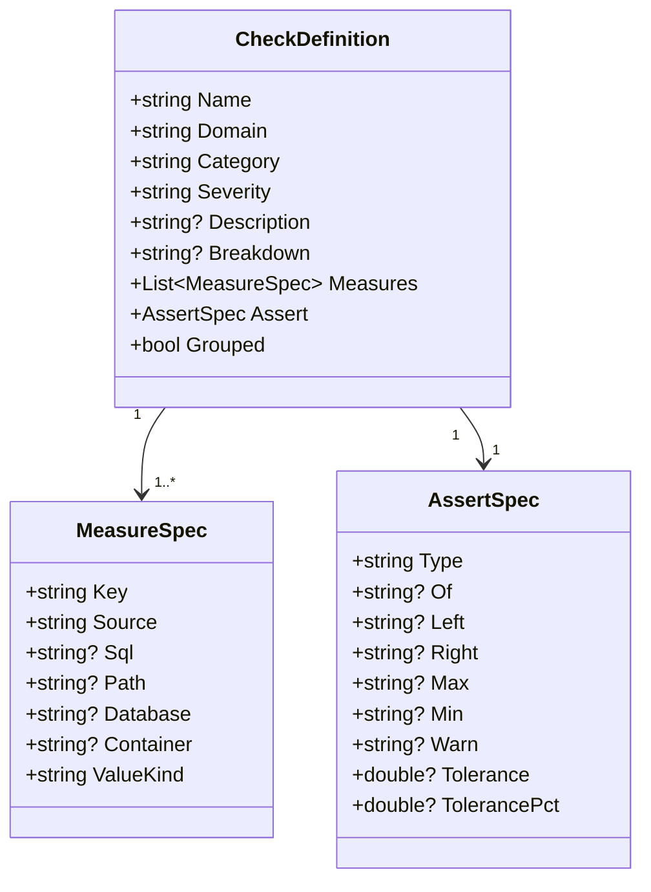
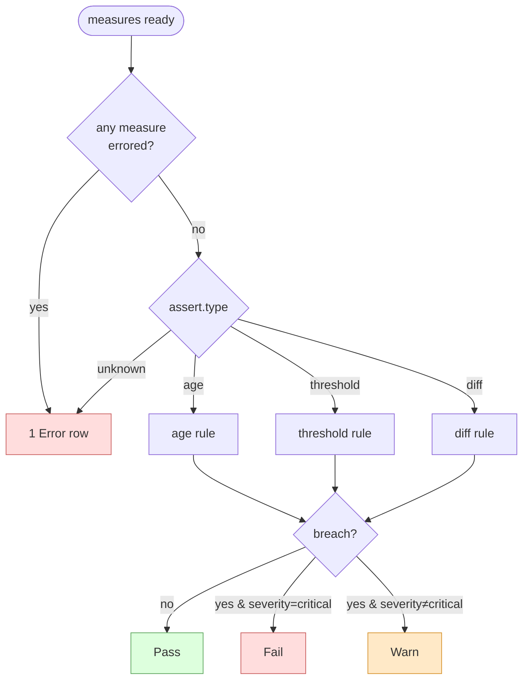
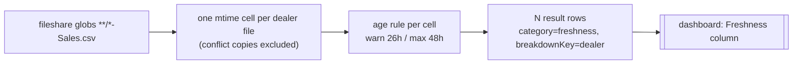

# Check Model & Asserts

A check is the unit of work. It resolves to: *run measure(s) → produce metric(s), optionally per breakdown group → apply an `assert` → write one result row per group per run.* This page covers the anatomy of a check, the difference between scalar and grouped measures, and exactly how each assert type turns numbers into a verdict.

## Anatomy of a check



| Field | Purpose |
|---|---|
| `name` | Stable identifier — also the result-row `checkName`. Convention: `category.family.detail` (e.g. `freshness.source.sales`). |
| `domain` | Owning pack (`sync-agent`, `tickets`). Becomes the sink partition. |
| `category` | `freshness` / `reconciliation` / `quality` / `flow` — the dashboard's top axis. |
| `severity` | `critical` → a breach is a `Fail`; `warning` / `info` → a breach is a `Warn`. |
| `description` | Optional one-liner, surfaced as a dashboard tooltip. Self-documenting and survives package promotion. |
| `breakdown` | When set, the check is **grouped** — the assert is applied per group and one row is emitted per group. |
| `measures` | One or more named measures (see below). A `diff` needs two; `age`/`threshold` typically one. |
| `assert` | The rule applied to the measured values. |

## Measures: scalar vs. grouped

A measure names a **source** and how to read one metric from it. The shape of the SQL depends on whether the check is grouped:

- **Scalar** — select a `v` column → one cell, keyed by the empty string.
- **Grouped** (`breakdown` set) — select `k` and `v` → one cell per `k`.

A measure carries a `valueKind`:

| `valueKind` | Cell holds | Used by |
|---|---|---|
| `number` *(default)* | a numeric value | `threshold`, `diff` |
| `timestamp` | a `DateTimeOffset` (treated as **UTC**) | `age` |
| `count` | a count of matching files | the file-share source |

!!! warning "Timestamps are treated as UTC"
    For `valueKind: timestamp`, the selected value is interpreted as UTC. If a source column stores local/naive time, normalize it in the measure SQL — e.g. `MAX(InvoiceDate) AT TIME ZONE '<source-tz>' AT TIME ZONE 'UTC'`.

## How an assert is evaluated

Evaluation has one global guard and then a per-type rule. If **any** measure returned an error, the whole check short-circuits to a single `Error` row. Otherwise the assert runs per cell, and a breach maps to `Fail` or `Warn` according to the check's `severity`.



`severity` → status on breach:

| `severity` | Breach becomes |
|---|---|
| `critical` | `Fail` |
| `warning` / `info` | `Warn` |

## Assert taxonomy

The taxonomy was pressure-tested against sync counts, surveys, SSC, reminders, and appointments. Three types are implemented today; the rest are designed and arrive with their first real consumer.

| Assert | Status | Use | Example |
|---|---|---|---|
| `age` | ✅ implemented | freshness | source CSV mtime / `MAX(InvoiceDate)` older than an SLA |
| `threshold` | ✅ implemented | scalar floor/ceiling, null-rate, uniqueness | duplicate keys `> 0` |
| `diff` | ✅ implemented | two sources, with tolerance | DuckDB vs Cosmos counts, ±0.5% |
| `rate` | 🔜 planned | share of a sub-group vs whole | WhatsApp delivered ≥ 90% |
| `backlog` | 🔜 planned | rows stuck in a state past an age SLA | SSC `RecallExists & TicketID=null` > 15m |
| `funnel` | 🔜 planned | cohort conversion stage N → N+1 in a window | reminders created → sent ≥ 95% in 4h |
| `anomaly` | 🔜 planned | vs. a historical baseline | today's volume vs. trailing median |

!!! note "Riding on `threshold` until a second case appears"
    The Tickets SSC escalation backlog currently ships as a `threshold` with the aging predicate written into the SQL (`_ts` vs `GetCurrentTimestamp()`). A dedicated `backlog` assert type waits for a second backlog case to justify the abstraction.

### `age` — freshness

Picks one measure (the `of` key, or the first). Computes `now - timestamp` for each cell.

| Outcome | Condition |
|---|---|
| `Warn` (future) | timestamp is **in the future** — likely future-dated/bad rows; filter them in the measure SQL |
| breach | `age > max` |
| `Warn` | `age > warn` (when `warn` is set, below `max`) |
| `Pass` | within SLA |

Metrics: `ageHours`, `maxHours`.

!!! info "The future-date guard"
    A future timestamp would otherwise mask staleness (a row dated 100 days ahead makes `MAX(date)` look perfectly fresh). Rastgo treats a future newest-value as a `Warn` with an explanatory message rather than a silent `Pass` — and checks should also filter future rows in the measure SQL.

### `threshold` — scalar floor/ceiling

Picks one measure. Breaches if the value is below `min` or above `max` (either bound optional).

Metrics: `value`, `min`, `max`. Use it for null-rates, duplicate-key counts, uniqueness, volume floors.

### `diff` — two sources, with tolerance

Requires `left` and `right` measure keys. For each shared group key, computes `left - right` and passes when `|diff| ≤ tolerance` **or** within `tolerancePct` of the right side.

Metrics: `left`, `right`, `diff`. This is the replica-trust workhorse (DuckDB ↔ Cosmos), where tolerance absorbs the transient drift between a point-in-time snapshot and live production.

## A worked example

A grouped freshness check over the source CSVs, one verdict per dealer file:

```yaml
- name: freshness.source.sales
  domain: sync-agent
  category: freshness
  severity: critical
  description: Sales feed delivery per dealer (source CSV mtime), independent of our load.
  breakdown: dealer
  measures:
    - key: delivered
      source: fileshare
      path: "**/*-Sales.csv"     # wildcard + breakdown ⇒ one mtime per matching file
      valueKind: timestamp
  assert:
    type: age
    of: delivered
    warn: 26h
    max: 48h
```

What happens at run time:



If one dealer's file is 4.9 days old, that *one* dealer's row goes `Fail` (severity `critical`) while the rest pass — a localized signal a global aggregate would hide.

---

Next: [Sources](sources.md) — the three sources that produce the cells, and the `v` / `k,v` SQL contract they expect.
