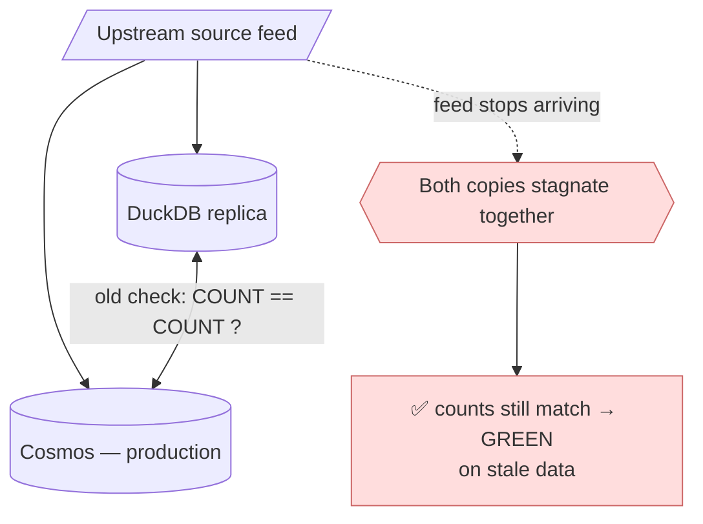
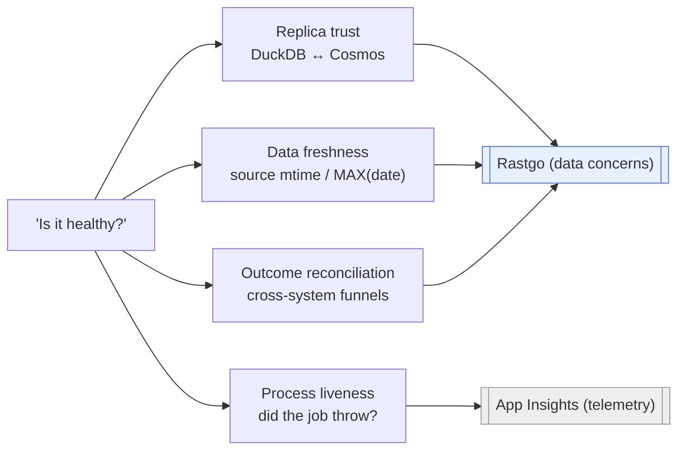
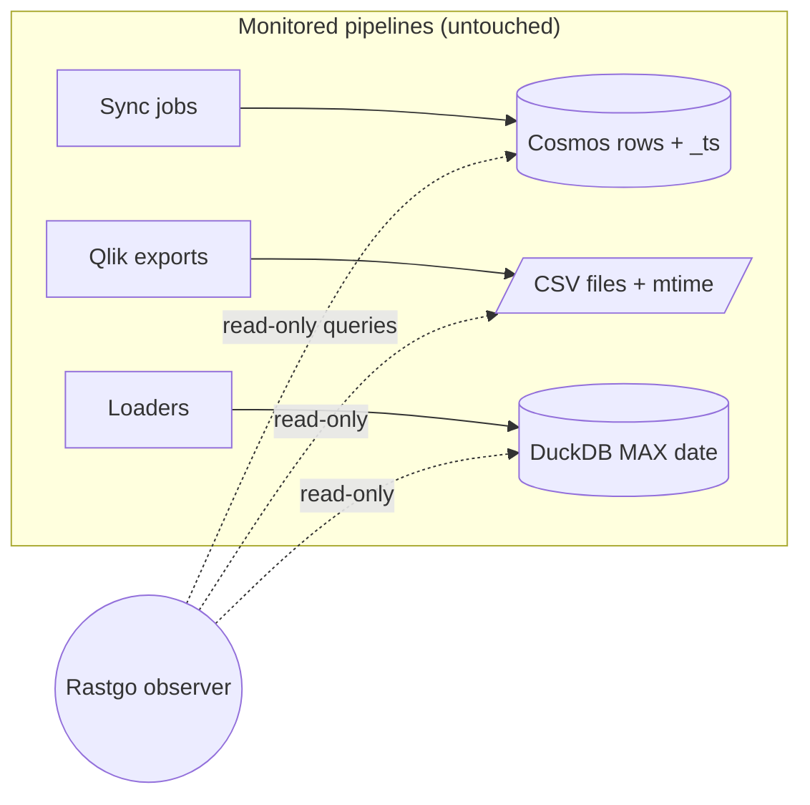
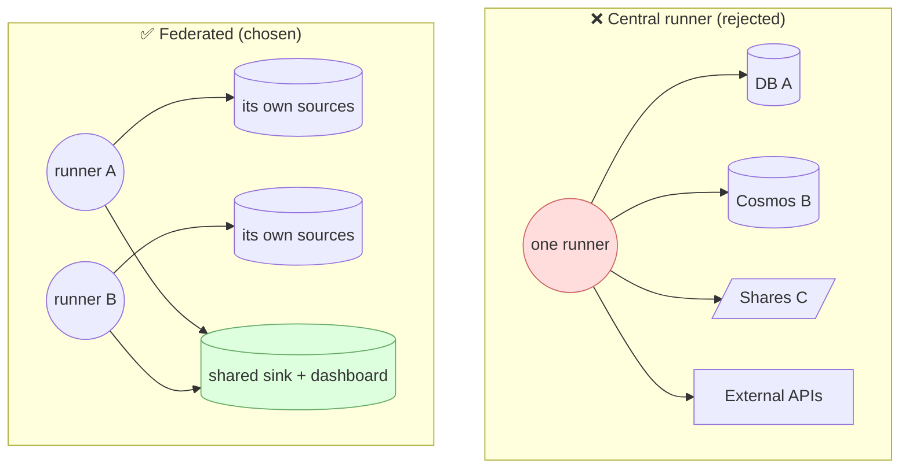
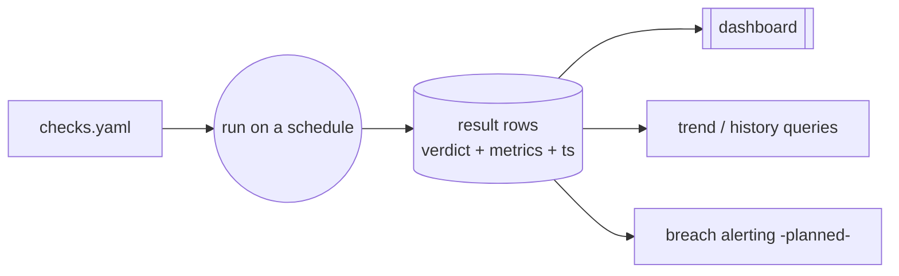

# Concepts & Principles

Rastgo exists because the monitoring it replaces answered the wrong question. This page explains the reframe and the four principles that fall out of it. They are worth understanding before reading the architecture — every design choice traces back to one of them.

## What the old checks measured

The previous setup (in `tiq-sync-duckdb-agent`) was a **migration-consistency validator** dressed up as operational health. ~22 HTTP endpoints ran `COUNT(*)` in DuckDB and in Cosmos, grouped by company/brand, and flagged a mismatch. App Insights availability tests pinged the endpoints; a Workbook showed up/down.

It answers *"do my two copies agree?"* — not *"is the data fresh, correct, and flowing?"* Those are different questions, and the gap between them is where real incidents hid.

### Why that is a structural blind spot

Both copies derive from the **same upstream source**. If the source stops arriving, *both* stagnate and *still agree* — so a replica-vs-replica comparison reports green on stale data. No amount of comparing the two copies can ever catch a dead feed. Add to that: a count mismatch returned HTTP 200, so the availability tests watching the endpoints never saw the signal; equality had no tolerance, so a point-in-time snapshot vs. live Cosmos drifted into a permanent, ignored "Degraded"; and the check logic was compiled into C#, so every new check meant a redeploy.

The fix is not a better count comparison. It is to **anchor freshness to the source**, keep the replica comparison only for what it is genuinely good at (replica trust), and make checks data instead of code.

## Principle 1 — Separate the concerns

The single "health" signal actually bundled several distinct questions. Rastgo pulls them apart and assigns each an owner. Three belong to Rastgo; **liveness stays with App Insights**, which is finally the right use of those availability tests.

| Concern | Why it's distinct | Assert |
|---|---|---|
| **Replica trust** | Cosmos is production; DuckDB is an independent recomputation. Comparing them catches transform/load divergence — but cannot see freshness (both go stale together). | `diff` (with tolerance) |
| **Data freshness** | Must be anchored to the source, not either copy. | `age` |
| **Outcome reconciliation** | "Did downstream produce what it should?" is a cross-system question (e.g. eligible sales vs. surveys created). | `funnel` / `rate` / `diff` |
| **Process liveness** | "The job threw" / "the app is down" is telemetry, not data. Leave it to App Insights. | — |

!!! info "Cosmos is production; DuckDB is a transform-aligned replica"
    `tiq-sync-agent` reads sources → transforms → **Cosmos** (read by downstream systems). `tiq-sync-duckdb-agent` applies the *same* transforms to the *same* sources → **DuckDB**, used for dev, batch reads (reports), and as an independent recomputation to reconcile against Cosmos. The `diff` comparison therefore keeps real value — it just cannot be the *freshness* signal.

## Principle 2 — Passive & read-only

Every signal Rastgo needs is **already persisted**: tickets carry per-stage timestamps and status; SSC logs carry status + `TicketID` + `_ts`; source files carry an mtime; loaded tables carry `MAX(date)`. The observer queries these footprints — it does not instrument the monitored pipelines.

The payoff is **near-zero blast radius** and free iteration: you can add, change, or remove checks without redeploying a single monitored system. The few things this *can't* see — a job that threw before writing anything, an external API that is down — are exactly the liveness cases that belong to App Insights.

## Principle 3 — Federated: federate the results, not the connections

A tempting design is one central runner holding credentials to every repo's DB, Cosmos, file shares, and external APIs. Rastgo **rejects** that: it means secrets sprawl, a huge blast radius, and deploys coupled across teams.

Instead, checks run where the data and credentials already live. Each app hosts a thin runner over its *own* connections and writes result rows to the shared sink. The only thing centralized is the **contract** (the result-row schema), the **sink**, and the **dashboard**.

This is also what makes promotion to a shared NuGet package the natural home: the framework is the package; the **checks** (domain packs) stay in each consumer repo as config.

## Principle 4 — Checks are data, with history

A check is declarative config, not a compiled method. A run produces **result rows** — verdict, metrics, timestamp, sample — appended to a store. That single decision delivers three things the old setup lacked:

- **Iterability** — change a threshold by editing YAML.
- **History** — "how long has TBP broker stock been stale?" is a query over past rows, not a guess.
- **Separation of render from logic** — the dashboard is just a view over the result rows; the checks don't know it exists.

The unifying shape for every data concern is the same: **run SQL/assertions on a schedule → write one result row per check per run → render a dashboard → alert on breach.** That is the solved category of *data observability*; Rastgo is a focused implementation of it for the ADP platform.

---

Next: [Architecture](architecture.md) turns these principles into concrete components and a run lifecycle.
