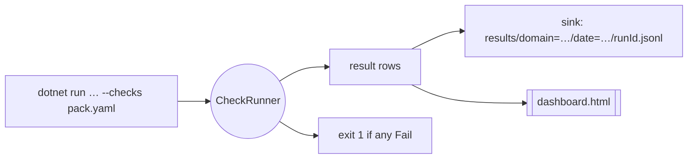

# Getting Started

This walkthrough installs the packages, composes the framework in a host, authors a check pack, runs it, and reads the dashboard.

## 1. Install

Reference the package:

```xml
<PackageReference Include="ShiftSoftware.ADP.Rastgo" Version="$(ADPVersion)" />
```

!!! info "One package today"
    Rastgo ships as a single package containing the engine and all three sources. If a consumer later needs to avoid a heavy dependency (the native DuckDB payload, say), the DuckDB / Cosmos sources can be split into `…Rastgo.DuckDB` / `…Rastgo.Cosmos` packages — the `AddRastgo*` methods below already draw the seam. Inside the ADP monorepo, develop against the project reference; published consumers use the NuGet package.

## 2. Compose the framework

Chain the registration extensions: `AddRastgoCore` wires the runner, sink, dashboard, and file-share source; `AddRastgoDuckDb` / `AddRastgoCosmos` each add their source. The `SourceRegistry` collects them all and resolves by name at run time.

```csharp
services
    .AddRastgoCore(o =>
    {
        o.FileShareBase = config["Rastgo:FileShareBase"]!;
        o.ResultsRoot   = config["Rastgo:ResultsRoot"]!;
    })
    .AddRastgoDuckDb(config.GetConnectionString("DuckDBRead")!)
    .AddRastgoCosmos(config.GetConnectionString("CosmosDB"));   // null connection string is allowed
```

Then resolve and run:

```csharp
var runner = sp.GetRequiredService<CheckRunner>();
var sink   = sp.GetRequiredService<JsonlResultSink>();

var checks = YamlCheckLoader.LoadFile("checks.sync-agent.yaml");
var runId  = Guid.NewGuid().ToString("N");
var now    = DateTimeOffset.UtcNow;

var results = await runner.RunAsync(checks, runId,
    log: msg => { Console.WriteLine(msg); return Task.CompletedTask; });

await sink.WriteAsync(results, runId, now);
await File.WriteAllTextAsync(
    Path.Combine(config["Rastgo:ResultsRoot"]!, "dashboard.html"),
    DashboardRenderer.Render(sink.ReadAll(), now));
```

!!! tip "Manual composition is fine too"
    The DI extensions just package the wiring. A host can equally new up the sources and pass them to `new SourceRegistry(sources)` / `new CheckRunner(registry)` — which is exactly what the `HealthRunner` console does today.

## 3. Author a check pack

A pack is a YAML file of checks for one domain. Start small — a freshness check and a quality check:

```yaml
- name: freshness.source.sales
  domain: sync-agent
  category: freshness
  severity: critical
  description: Sales feed delivery per dealer (source CSV mtime).
  breakdown: dealer
  measures:
    - { key: delivered, source: fileshare, path: "**/*-Sales.csv", valueKind: timestamp }
  assert: { type: age, of: delivered, warn: 26h, max: 48h }

- name: quality.vehicleentry.duplicate_vins
  domain: sync-agent
  category: quality
  severity: warning
  description: There should be no duplicate VINs in the loaded snapshot.
  measures:
    - key: dupes
      source: duckdb
      sql: "SELECT COUNT(*) AS v FROM (SELECT VIN FROM VehicleEntry GROUP BY VIN HAVING COUNT(*) > 1)"
  assert: { type: threshold, of: dupes, max: "0" }
```

The check file ships with the consumer as **config** — packs live in the consumer repo, not in the NuGet package.

## 4. Run it

During development the `HealthRunner` console runs a pack against a copied snapshot and writes the results + dashboard. Useful flags:

| Flag | Effect |
|---|---|
| `--seed-demo` | Create a self-contained demo DuckDB and run `checks.demo.yaml` against it. |
| `--schema` | Introspect the DuckDB snapshot (tables / columns / row counts / freshness candidates) to help author checks. |
| `--checks <path>` | The check file to run (default: `checks.sync-agent.yaml`). |
| `--out <dir>` | Output root for results + dashboard (default: `./health-output`). |
| `--fileshare <dir>` | Base path for `fileshare` measures. |

```bash
# zero-config smoke test — seeds a demo db and runs the demo pack
dotnet run --project tiq-sync-agent.HealthRunner -- --seed-demo

# run a real pack against the configured snapshot
dotnet run --project tiq-sync-agent.HealthRunner -- --checks checks.sync-agent.yaml --out ./health-output
```

The console prints a per-check verdict line and a status tally, and exits non-zero if any check is `Fail` — so a scheduled run doubles as a CI/operational gate.



## 5. Read the dashboard

Open `dashboard.html` from the output root. It is self-contained — no server, no CDN. Results are organized on the **Category** axis (Freshness / Reconciliation / Quality / Flow) with a Domain filter, status KPI filters, and per-check description tooltips. Every row is in the DOM, so the browser's Ctrl+F finds any check, dealer, or message.

Because the dashboard is just a view over the result rows, re-running a pack refreshes it, and a brand-new domain shows up automatically the first time it writes rows.

## Where to go next

- [Concepts & Principles](concepts.md) — the *why* behind the design.
- [Check Model & Asserts](check-model.md) — the full assert taxonomy.
- [Sources](sources.md) — source specifics and the per-hop localization trick.
- [Configuration](configuration.md) — every YAML field.
