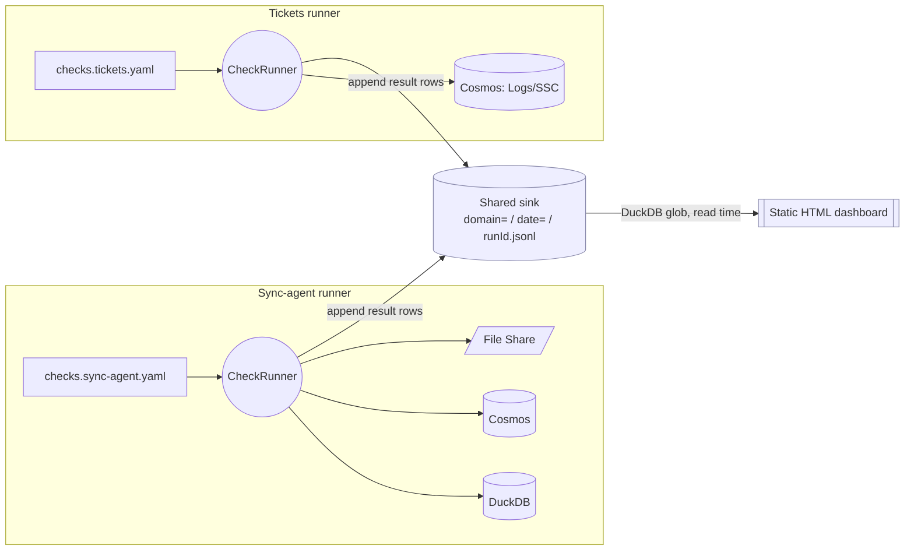

  
  

# Rastgo — Data Reliability Framework

Rastgo is a small, **declarative** framework for monitoring **data correctness, freshness, and pipeline flow** across the ADP platform. Instead of hand-written, per-endpoint health checks compiled into C#, a check is a few lines of YAML with inline SQL: *run a measure, apply an assert, write one result row per run.* Results are stored as data with history and rendered on a single dashboard.

It replaces the older "does my replica match?" count-comparison checks (and the half-built Azure Workbook) with a model that answers the question that actually matters: **is the data fresh, correct, and flowing?**

!!! note "The name"
    *Rastgo* (ڕاستگۆ) means "truthful / straight-talking" — the framework's job is to tell you the plain truth about your data, not a green pixel that hides a stale replica.

## Package

Rastgo ships as a **single package** today — the core engine plus the read-only DuckDB / Cosmos / file-share sources. The source connectors are kept isolation-ready: if a consumer ever needs to avoid a heavy dependency (e.g. the native DuckDB payload), they can be peeled into separate `…Rastgo.DuckDB` / `…Rastgo.Cosmos` packages later without changing the API.

| | |
|---|---|
| **Package ID** | `ShiftSoftware.ADP.Rastgo` |
| **Target Framework** | `.NET 10` |
| **Dependencies** | `YamlDotNet`, `DuckDB.NET.Data.Full`, `Microsoft.Azure.Cosmos`, `Newtonsoft.Json` |
| **Check config** | YAML + inline SQL |
| **Result store** | partitioned append-only JSONL (Parquet-ready) |

## Key Capabilities

| Capability | Description |
|---|---|
| **Config, not code** | Checks are declarative YAML with inline SQL. A new check or a changed threshold is a config edit, not a recompile-and-redeploy. |
| **Results are data** | Every run appends result rows with a verdict, metrics, and a timestamp — so trend questions ("how long has this been stale?") are answerable without KQL. |
| **Federated** | Checks run *where the data and credentials already live*. Each app hosts a thin runner over its own connections; only the result-row contract, sink, and dashboard are shared. |
| **Passive & read-only** | The observer queries footprints the monitored pipelines already leave (row timestamps, file mtimes, status columns). It never instruments or mutates them — near-zero blast radius. |
| **Source-anchored freshness** | Freshness is measured against the *source* (file mtime, `MAX(date)`), so it catches a feed that stopped arriving — something no replica-vs-replica comparison can ever see. |
| **One dashboard** | A self-contained static HTML dashboard unions every domain's results at read time. No CDN, no runtime, all rows in the DOM (so Ctrl+F works). |

## The shape of the system

Every consumer runs its own checks against its own sources, then writes result rows to one shared sink that a single dashboard reads:

The only cross-system contract is the **result-row schema**. A new app joins the platform by shipping a YAML pack + writing to the shared sink — never by handing its credentials to a central runner.

## The three concerns (kept separate)

Rastgo deliberately separates concerns the old setup conflated, and leaves the one it shouldn't own to App Insights:

| Concern | Question it answers | Signal source | Owner |
|---|---|---|---|
| **Replica trust** | Does prod Cosmos match an independent recomputation? | DuckDB ↔ Cosmos | Rastgo (`diff`) |
| **Data freshness** | Did data arrive on each source's schedule? | source files + `MAX(date)` | Rastgo (`age`) |
| **Outcome reconciliation** | Did downstream processes produce/flow what they should? | cross-system (surveys, funnels) | Rastgo (`funnel`/`rate`) |
| **Process liveness** | Did the job throw / is the app down? | failure telemetry + emails | **App Insights** (not Rastgo) |

## Documentation

| Section | Description |
|---|---|
| [Concepts & Principles](concepts.md) | Why the old checks answered the wrong question, and the design principles (passive, federated, source-anchored) that replace them. |
| [Architecture](architecture.md) | Components, the run lifecycle, the result-row schema, the partitioned sink, and the dashboard. |
| [Check Model & Asserts](check-model.md) | The anatomy of a check, scalar vs. grouped measures, and the assert taxonomy (`age` / `threshold` / `diff` …). |
| [Sources](sources.md) | The three built-in sources (DuckDB / Cosmos / file-share), the `v` / `k,v` SQL contract, and the isolation-ready packaging. |
| [Configuration](configuration.md) | Full YAML field reference, connection configuration, and the result-row schema. |
| [Getting Started](getting-started.md) | Compose the framework, author a checks pack, run it, and read the dashboard. |
