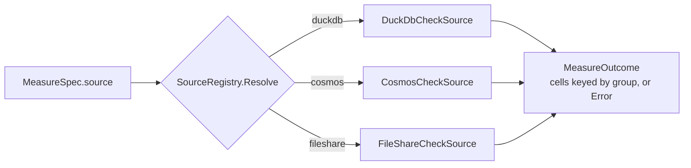
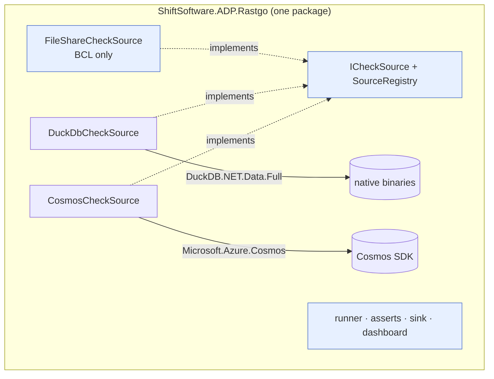
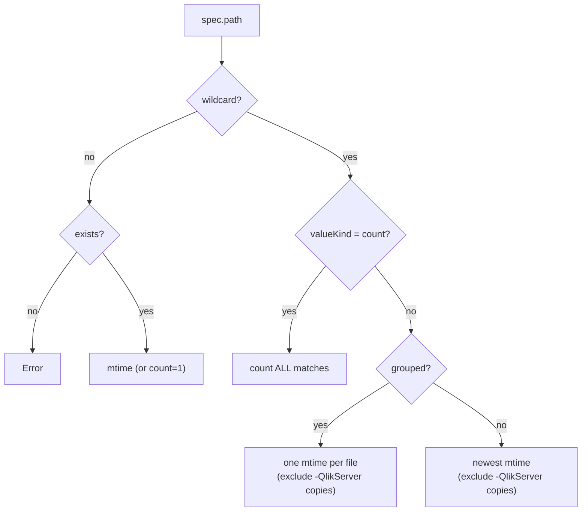
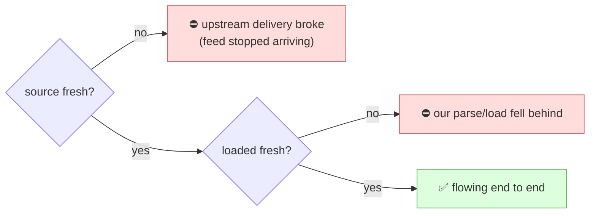

# Sources

A **source** is a read-only provider of metrics. Every source implements one small interface; the runner resolves them by name and never knows the difference between a DuckDB query and a file mtime. This page covers the contract, the three built-in sources, and how the package is kept ready to split later.

## The contract

```csharp
public interface ICheckSource
{
    string Name { get; }   // referenced by MeasureSpec.Source — "duckdb", "cosmos", "fileshare"
    Task<MeasureOutcome> MeasureAsync(MeasureSpec spec, bool grouped, CancellationToken ct);
}
```

A source returns a `MeasureOutcome`: a dictionary of **cells** keyed by group (`""` for scalar), or an `Error` string. Two conventions hold across all query sources:

- **Scalar** measures select a `v` column → one cell.
- **Grouped** measures select `k` and `v` → one cell per `k`.



Everything is read-only by construction — a source issues queries and reads file metadata; it has no write path.

## Packaging (isolation-ready)

Rastgo currently ships as a **single package** — `ShiftSoftware.ADP.Rastgo` carries the engine and all three sources. The source classes are deliberately kept self-contained so that, if a consumer ever needs to shed a heavy dependency (the native DuckDB payload, or the Cosmos SDK), the DuckDB and Cosmos sources can be peeled into `…Rastgo.DuckDB` / `…Rastgo.Cosmos` packages later — the `ICheckSource` contract and the `AddRastgo*` DI methods already draw the seams.



!!! note "When to split"
    The split earns its keep only when a real consumer wants the core (or Cosmos) without the native DuckDB payload, or vice-versa. Until then, one package is simpler to version, pack, and reference. A `.Sql` source is similarly deferred until the Portal surveys pack needs it.

## DuckDB source &nbsp;`name: duckdb`

Reads metrics from a DuckDB database — typically the published read snapshot. The measure SQL selects `v` (scalar) or `k, v` (grouped). For `valueKind: timestamp`, the selected value is treated as **UTC** (normalize local columns in SQL).

```yaml
- name: quality.vehicleentry.null_invoice_date
  domain: sync-agent
  category: quality
  severity: warning
  measures:
    - { key: nulls, source: duckdb, sql: "SELECT COUNT(*) AS v FROM VehicleEntry WHERE InvoiceDate IS NULL" }
  assert: { type: threshold, of: nulls, max: "0" }
```

It opens a lazy, reused connection and streams the reader into cells — a scalar reads the `v` ordinal; a grouped read also reads `k`.

## Cosmos source &nbsp;`name: cosmos`

Reads metrics from Cosmos DB. A measure must supply `sql`, `database`, and `container`; select `... AS v` (and `... AS k` when grouped).

```yaml
- name: reconciliation.sscaffectedvin.count
  domain: sync-agent
  category: reconciliation
  severity: warning
  measures:
    - { key: duck,   source: duckdb, sql: "SELECT COUNT(*) AS v FROM SSCAffectedVIN" }
    - { key: cosmos, source: cosmos, database: AdpDb, container: SSC, sql: "SELECT VALUE COUNT(1) FROM c" }
  assert: { type: diff, left: duck, right: cosmos, tolerance: 0 }
```

!!! info "A missing Cosmos connection degrades gracefully"
    If the source is constructed with a null client (no connection string configured), its measures return an error string rather than throwing — so cosmos checks report a source `Error` while the rest of the run completes normally.

## File-share source &nbsp;`name: fileshare`

Surfaces the **most upstream hop we can see** — external systems → Qlik → Azure Storage Sync → the file share. This is how Rastgo tells *"did data actually get delivered?"* apart from *"did our parse/load succeed?"*. `path` is relative to a configured base.

| Path form | Behavior |
|---|---|
| plain path | that file's last-write time (a timestamp) |
| wildcard, scalar | the **newest** match's mtime (conflict copies excluded) |
| wildcard + `breakdown` | one mtime per matching file (auto-covers every dealer/feed file) |
| `**/` prefix | recurse from the base |
| `valueKind: count` | number of matching files |



!!! tip "Conflict-copy aware"
    Azure File Sync leaves `-QlikServer*` conflict copies (stale duplicates). Freshness deliberately **ignores** them (so a stale duplicate can't look fresh), while `valueKind: count` deliberately **includes** them — that *is* the conflict-copy detector (260 conflict copies surfaced in one real run).

## Per-hop localization

Running the same family of checks at both the source hop and the loaded hop lets you localize a failure precisely — the single most useful diagnostic the file-share source enables:



A real run made this concrete: SAS/SAM/Kamaran *source* feeds were ~5 days stale (an upstream delivery gap) while our load was current — a distinction the old replica-vs-replica check could never draw.

---

Next: [Configuration](configuration.md) — the complete YAML field reference and connection setup.
