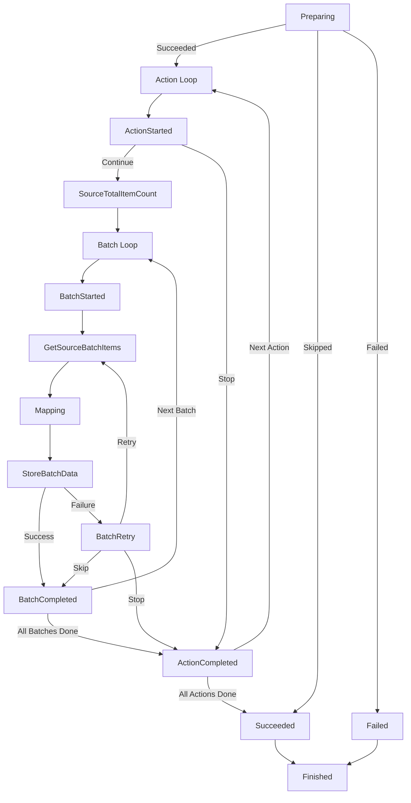

# Architecture

The Sync Engine is the core orchestrator of every data synchronization pipeline in the ADP Sync Agent. It manages the full lifecycle of a sync operation — from preparation through batch processing to completion — with built-in support for retries, cancellation, and progress tracking.

## Pipeline Lifecycle

Every pipeline execution follows a well-defined sequence of stages. Understanding this lifecycle is key to building reliable and predictable sync pipelines.



## Stages in Detail

### Preparing
The first stage of the pipeline. This is where adapters perform initialization work — such as loading and comparing CSV files or setting up database connections.

The preparing stage can return one of three results:

| Result | Behavior |
|---|---|
| `Succeeded` | Continue to the action loop. |
| `Skipped` | Mark the pipeline as successful without processing any data (e.g., no changes detected). |
| `Failed` | Mark the pipeline as failed immediately. |

### Action Loop

A sync pipeline processes data through one or more **actions**. Each action represents a category of data operation. The default action execution order is:

1. **Delete** — Remove obsolete records from the destination.
2. **Update** — Modify existing records in the destination.
3. **Add** — Insert new records into the destination.

This order is configurable. The available action types are:

| Action Type | Description |
|---|---|
| `Add` | Insert new records. |
| `Update` | Update existing records. |
| `Delete` | Remove records. |
| `Upsert` | Insert or update (used by Cosmos DB adapter). |

!!! info "Action Execution Order"
    The default order (Delete → Update → Add) ensures that stale data is cleaned up before new data arrives, reducing the risk of conflicts. You can customize this order via the `Configure` method.

### ActionStarted

Called at the beginning of each action. Return `true` to proceed with the action, or `false` to skip it entirely.

This is a good place for adapters to open file readers, prepare queries, or perform action-specific initialization.

### SourceTotalItemCount

An optional stage where the source adapter can report the total number of items to be processed for the current action. This enables:

- Accurate batch count calculation.
- Progress percentage tracking.
- Estimated time remaining.

If not provided, the engine runs in **streaming mode** — processing batches until the source returns no more items.

### Batch Loop

The core of the pipeline. Data is processed in configurable batches to manage memory and enable granular retry.

Each batch goes through the following stages:

#### BatchStarted
Called before each batch. Return `true` to process the batch, or `false` to stop the pipeline.

#### GetSourceBatchItems
Retrieves the next batch of items from the data source. On retry, the engine passes the previous batch items to avoid re-reading from the source.

#### Mapping
Transforms source items into destination items. Two mapping modes are available:

- **Simple Mapping** — A function that receives source items and the action type, returns destination items. On retry, previously mapped items are reused automatically.
- **Advanced Mapping** — Full access to the `SyncMappingInput` including previous mapped items and retry status, giving the developer complete control.

#### StoreBatchData
Writes the mapped items to the destination. Returns a `SyncStoreDataResult` that categorizes items as:

| Category | Description |
|---|---|
| `SucceededItems` | Items that were written successfully. |
| `FailedItems` | Items that failed to write. |
| `SkippedItems` | Items that were intentionally skipped. |

If the result contains failed items, a `RetryException` can be set to trigger the retry mechanism.

#### BatchRetry
Called when a batch fails. The developer can choose a retry strategy:

| Strategy | Behavior |
|---|---|
| `RetryAndStopAfterLastRetry` | Retry up to `MaxRetryCount`, then stop the entire action. **(Default)** |
| `RetryAndContinueAfterLastRetry` | Retry up to `MaxRetryCount`, then skip the failed batch and continue. |
| `Skip` | Skip the failed batch immediately and continue to the next. |
| `Stop` | Stop the entire action immediately. |

#### BatchCompleted
Called after a batch is successfully stored (or after the last retry with `RetryAndContinueAfterLastRetry`). Return `true` to continue, or `false` to trigger a retry.

This is where source adapters typically mark data as synced — for example, updating a `LastSynced` timestamp on processed records.

### ActionCompleted
Called after all batches for an action are processed. Return `true` to mark the action as successful, or `false` to mark it as failed.

### Succeeded / Failed
Called after all actions complete. `Succeeded` is invoked if all actions passed. `Failed` is invoked if any action failed or an unhandled exception occurred.

### Finished
Always called at the end of a pipeline execution, regardless of outcome. This is the place for cleanup — closing file handles, disposing resources, or deleting temporary directories.

## Cancellation & Timeouts

Every pipeline execution is governed by an `OperationTimeoutInSeconds` (default: 300 seconds). A `CancellationToken` is automatically created and passed to every stage. When the timeout expires, the pipeline raises an `OperationCanceledException`.

The cancellation token is available to all adapters and custom functions via `SyncFunctionInput.CancellationToken`.

## Single-Type vs. Dual-Type Pipelines

The Sync Engine supports two generic patterns:

- **`SyncEngine<T>`** — Source and destination share the same type. Useful when the data shape is identical (e.g., syncing between two databases with the same schema).
- **`SyncEngine<TSource, TDestination>`** — Source and destination use different types. This is the common case when transformation is required.

## Fluent Configuration

The Sync Engine uses a fluent API for setup:

```csharp
var engine = new SyncEngine<SourceModel, DestModel>();

engine
    .Configure(batchSize: 500, maxRetryCount: 3, operationTimeoutInSeconds: 600)
    .SetupPreparing(async input => SyncPreparingResponseAction.Succeeded)
    .SetupGetSourceBatchItems(async input => /* fetch batch */)
    .SetupMapping(async (items, actionType) => /* transform */)
    .SetupStoreBatchData(async input => /* write to destination */)
    .SetupBatchCompleted(async input => true);

var success = await engine.RunAsync();
```

## Data Adapter Model

Rather than wiring up every stage manually, the Sync Agent provides **Data Adapters** — pre-built components that encapsulate the logic for common data systems.

A Data Adapter implements the `ISyncDataAdapter` interface and automatically configures the relevant stages of the Sync Engine when its `Configure` method is called.

This means a typical pipeline setup is as simple as:

1. Create a `SyncEngine`.
2. Attach a **source adapter** (e.g., CSV, EF Core).
3. Attach a **destination adapter** (e.g., Cosmos DB, EF Core, DuckDB).
4. Provide a mapping function.
5. Call `RunAsync()`.

See [Data Adapters](data-adapters.md) for details on each built-in adapter and [Getting Started](getting-started.md) for end-to-end examples.
