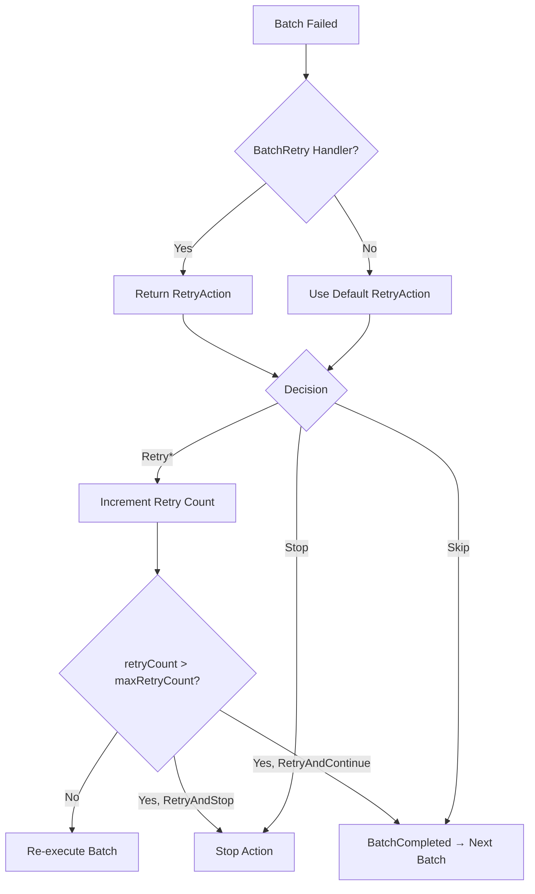

# Resilience & Fault Tolerance

Reliable data synchronization requires careful handling of failures. Networks go down, databases become temporarily unavailable, and API rate limits are hit. The ADP Sync Agent is designed to handle these scenarios gracefully, ensuring that transient failures don't result in data loss or inconsistent states.

## Retry Strategies

When a batch fails — whether due to a storage exception, a timeout, or a `RetryException` returned by `StoreBatchData` — the Sync Engine enters the retry flow.



### RetryAction Options

| Strategy | Behavior |
|---|---|
| `RetryAndStopAfterLastRetry` | Retry the batch up to `MaxRetryCount` times. If all retries are exhausted, **stop the entire action** and mark it as failed. `BatchCompleted` is **not** invoked. This is the **default** strategy. |
| `RetryAndContinueAfterLastRetry` | Retry the batch up to `MaxRetryCount` times. If all retries are exhausted, invoke `BatchCompleted` and **move to the next batch**. Use this when partial success is acceptable. |
| `Skip` | Skip the failed batch immediately **without retrying** and move to the next batch. `BatchCompleted` is invoked. |
| `Stop` | Stop the entire action immediately **without retrying**. `BatchCompleted` is **not** invoked. |

### Configuring Retries

Set the default retry behavior at the engine level:

```csharp
engine.Configure(
    batchSize: 500,
    maxRetryCount: 3,
    defaultRetryAction: RetryAction.RetryAndContinueAfterLastRetry);
```

Override the default on a per-batch basis using the `BatchRetry` handler:

```csharp
engine.SetupBatchRetry(async input =>
{
    // Log the error
    Console.WriteLine($"Batch {input.Input.Status.CurrentStep} failed: {input.Input.Exception?.Message}");

    // Custom logic: stop immediately for critical errors
    if (input.Input.Exception is UnauthorizedAccessException)
        return RetryAction.Stop;

    // Otherwise, retry
    return RetryAction.RetryAndStopAfterLastRetry;
});
```

## Retry Behavior in Adapters

The retry system is integrated into the built-in adapters at multiple levels:

### Source Data on Retry

When a batch is retried, the `GetSourceBatchItems` stage receives the previous batch items via `SyncGetBatchDataInput.PreviousItems`. Built-in source adapters automatically return the previous items on retry, avoiding redundant reads from the source.

### Mapping on Retry

The **simple mapping** (`SetupMapping`) automatically reuses previously mapped items on retry — avoiding unnecessary re-transformation. The **advanced mapping** (`SetupAdvancedMapping`) gives you full control via `SyncMappingInput.PreviousMappedItem`.

### Storage on Retry

The `StoreBatchData` stage receives the previous result via `SyncStoreDataInput.PreviousResult`. Adapters like `CosmosSyncDataDestination` use this to retry only the failed items from the previous attempt, rather than re-processing the entire batch.

## Cosmos DB Retry Pipeline

The Cosmos DB destination adapter includes an additional layer of resilience powered by [Polly](https://github.com/App-vNext/Polly). Each individual Cosmos DB operation (upsert or delete) is wrapped in a Polly retry pipeline that handles transient HTTP failures and rate limiting (HTTP 429).

This means a single batch may succeed even if individual items experience transient failures — they are retried transparently before the batch result is computed.

## Atomic Execution

A pipeline execution is considered successful only if **all critical operations** complete:

1. **Reading** from the source.
2. **Transforming** the data.
3. **Writing** to the destination.
4. **Marking the source as synced** (e.g., updating timestamps, storing the synced CSV file).

If any of these steps fail, the pipeline reports failure. The developer controls whether partial results are committed based on the retry strategy and the `BatchCompleted` handler.

### CSV Source Atomicity

The CSV source adapter implements atomicity through a two-phase approach:

- During processing, changes are written to the destination.
- Only on `Succeeded`, the new version of the CSV file is stored to the content repository.
- If the pipeline fails, the next run will re-compare against the same baseline, automatically picking up the un-synced changes.

### EF Core Source Atomicity

The EF Core source adapter updates the `SyncTimestamp` property on source records in the `BatchCompleted` stage. If the pipeline fails before this point, those records remain eligible for sync on the next run.

## Operation Timeouts

Every pipeline execution has a timeout configured via `operationTimeoutInSeconds` (default: 300 seconds). A `CancellationToken` is created with this timeout and passed to every stage.

When the timeout expires:

1. The cancellation token is triggered.
2. An `OperationCanceledException` is raised at the next cancellation check.
3. The `Failed` handler is invoked.
4. The `Finished` handler is invoked for cleanup.

!!! warning "Timeout Planning"
    Set the timeout generously enough to accommodate the total data volume, batch size, and expected latency of your source and destination systems. For large initial syncs, consider using a longer timeout or breaking the work into smaller pipeline runs.

## Error Handling Lifecycle

The Sync Engine provides three stages for handling pipeline-level errors:

| Stage | When Called | Purpose |
|---|---|---|
| `Failed` | When the pipeline fails (any action fails or an unhandled exception is thrown). | Logging, alerting, cleanup of partial state. Receives the exception if available. |
| `Succeeded` | When all actions complete successfully. | Post-success operations like storing the synced CSV file or sending notifications. |
| `Finished` | Always called at the end, regardless of outcome. | Final cleanup — deleting temp files, disposing resources. |

```csharp
engine
    .SetupFailed(async input =>
    {
        logger.LogError(input.Input, "Pipeline failed");
        await alertService.SendAlertAsync("Sync pipeline failed");
    })
    .SetupSucceeded(async input =>
    {
        logger.LogInformation("Pipeline completed successfully");
    })
    .SetupFinished(async input =>
    {
        // Always runs — clean up resources
        await tempFileService.CleanupAsync();
    });
```
