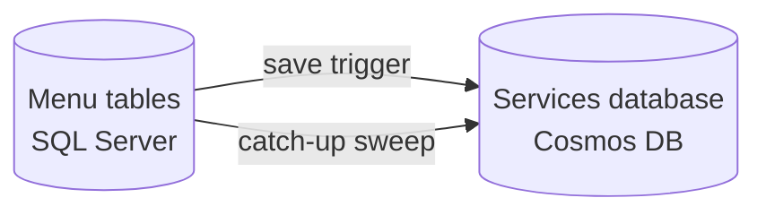

# Cosmos Replication

The menu catalog lives in SQL Server, but the vehicle lookup reads from Cosmos DB. This page is how a host
projects its menu catalog into Cosmos: what to provision, what to register, how to backfill an existing
catalogue, and how to check it actually worked.

Replication is **opt-in**. A host that never calls `AddMenuReplications` replicates nothing — which is what
a read-only host, fed from elsewhere, wants.

## What gets replicated

Every menu table projects **per row** into a document. No aggregation happens at write time; the documents
are raw, and menu codes are generated when they are read.



Seven containers, following the same shape as the rest of the platform — one container per master entity,
plus one container holding a model's whole menu graph:

| Container | Holds | Partition key |
|---|---|---|
| `ServiceMenus` | the variant and its three link tables, as four document types | `/BasicModelCode` + `/ItemType` |
| `ServiceIntervals` | service intervals | `/id` |
| `ServiceIntervalGroups` | interval groups | `/id` |
| `ReplacementItems` | replacement items | `/id` |
| `StandaloneReplacementItemGroups` | standalone groups | `/id` |
| `LabourRateMappings` | labour-rate mappings | `/id` |
| `BrandMappings` | brand mappings | `/id` |

`ServiceMenus` documents are **fully denormalized** — they carry the interval codes, group labour codes,
replacement-item details, labour-rate codes and brand abbreviations that menu generation needs. So reading a
model's menu is one single-partition query on its basic model code, with no second round trip and no
reader-side cache to go stale. Keeping those embedded copies fresh is replication's job: editing a master row
fans the change out to every document that embeds it.

## 1. Add the bookkeeping columns

The ten replicated entities implement `IShiftEntityReplication`, which adds two columns:

```csharp
public string? LastReplicationStamp { get; set; }
public DateTimeOffset? LastReplicationDate { get; set; }
```

They come with the entities, so a host only needs the **migration**:

```bash
dotnet ef migrations add AddMenuReplicationColumns
dotnet ef database update
```

Both columns are written by the replication pipeline and by nothing else. `LastReplicationDate` is a
*watermark*, not a timestamp — it holds the `LastSaveDate` of the row version that reached Cosmos, so equality
means "in sync" and `null` means "never replicated".

!!! warning "A table without the columns is silently skipped"
    Both replication paths are constrained on `IShiftEntityReplication`. A table whose migration was missed
    is not an error — it simply never replicates.

## 2. Provision the containers

```csharp
using ShiftSoftware.ADP.Menus.Data.Replication;

var report = await MenuCosmosProvisioning.EnsureContainersAsync(cosmosClient);

logger.LogInformation(
    "{Created} of {Total} menu containers created in {Database}.",
    report.CreatedCount, report.Containers.Count, report.DatabaseName);
```

Idempotent, so it is safe on every start. `MenuCosmosContainers.All` is the single declaration of what to
create and with which key, so the list is never retyped at a call site.

!!! danger "Provision before the first save"
    The save trigger is **fire-and-forget**: a write to a container that does not exist is logged and dropped,
    never surfaced to the save that triggered it. A host that registers the trigger but never provisions looks
    wired up and quietly writes nothing.

`EnsureContainersAsync` throws `InvalidOperationException` when a container already exists with a **different**
partition key. That is deliberate: a partition key cannot be changed after creation, and
`CreateContainerIfNotExists` is a no-op on an existing container — so without the check a container created
earlier with the wrong key is accepted silently and every document lands in the wrong partition. Recovering
means dropping and recreating the container, so it is worth failing at boot with a name in the message.

Optional throughput arguments are passed straight through when the database or a container has to be created:

```csharp
await MenuCosmosProvisioning.EnsureContainersAsync(
    cosmosClient,
    databaseThroughput: ThroughputProperties.CreateAutoscaleThroughput(4000));
```

## 3. Register the save trigger

```csharp
services.AddShiftEntityCosmosDbReplicationTrigger<DB>(x =>
    x.AddMenuReplications<DB>(cosmosClient));
```

That is the whole registration. It projects every menu row on `SaveChanges`, and it also enables
EFCore.Triggered on the context — the after-save hook replication rides on — so `AddDbContext` does not need to.

Individual `Add…Replication` methods exist per table if a host needs to replicate a subset, but
`AddMenuReplications` is the intended entry point.

## 4. Backfill an existing catalogue

The trigger only ever sees rows **as they are saved**. A catalogue that existed before replication was switched
on never reaches Cosmos at all, and neither does anything missed while Cosmos was unreachable. The catch-up
sweep is what closes that:

```csharp
// Every table, every row. First switch-on, or after rebuilding a container.
await cosmosReplication.ReplicateAllAsync(database, connectionString, databaseId, updateAll: true);

// Dirty rows only — cheap, and what a scheduled pass should run.
await cosmosReplication.ReplicateAllAsync(database, connectionString, databaseId);
```

`updateAll: false` syncs only rows whose watermark is behind their `LastSaveDate`. Per-table methods
(`ReplicateMenuVariantAsync`, `ReplicateServiceIntervalAsync`, …) exist so a host can schedule tables
independently.

The sweep shares its include graphs, projections and fan-out queries with the trigger, so both paths write
byte-identical documents.

!!! note "The sweep host must map the tables the same way the writing host does"
    A second `DbContext` over the same database is only safe when its model agrees. EF Core names a table after
    its `DbSet` property when one exists, so a context that declares `DbSet`s where the writing host does not
    will look for differently-named tables. See `MenuReplicationDB` in the sample Functions host.

## 5. Verify

```csharp
var status = await MenuReplicationStatus.ReadAsync(database);

if (!status.IsUpToDate)
    logger.LogWarning("{Pending} of {Total} menu rows are not replicated.", status.Pending, status.Total);
```

Per table: `Total`, `NeverReplicated`, `Pending` and `InSync`; across the catalogue: the same roll-ups plus
`IsUpToDate`.

!!! warning "A partial sweep looks exactly like a complete one"
    A row the sweep fails to write is marked unsuccessful and skipped — no exception, no log line — so a run
    that wrote 1060 of 1188 documents finishes the same way one that wrote all of them does. It is idempotent
    and self-healing, so the fix is simply to run it again; this report is how you know you need to. On a small
    container, throughput throttling during a bulk pass is the usual cause.

The reading is SQL-side: it says the pipeline believes every row is replicated. It cannot see a document staled
by an edit that bypassed its owning row — for that, run a full `updateAll: true` pass.

## What replication does and does not catch

| Operation | Result |
|---|---|
| Insert / update | document upserted |
| **Soft delete** (`IsDeleted = true`) | an ordinary update — the document is upserted and **stays present**, carrying `IsDeleted` |
| Hard delete | document deleted, using the coordinates in `LastReplicationStamp` |
| `id` or partition-key change (e.g. a renamed basic model code) | stale document deleted, new one written |
| Master row **edited** | fans out to every document embedding it |
| Master row **inserted** | no fan-out — nothing references it yet |
| Master row **hard-deleted** | no fan-out; embedded copies remain until the next full sweep |

Three consequences worth designing around:

- **Readers must filter on `IsDeleted`.** A soft delete leaves the document in place. Every replicated document
  carries the flag for that reason.
- **A row that has never been replicated cannot be cleaned up on hard delete.** With no stamp there are no
  coordinates to delete by, so its document is orphaned. A full sweep before enabling deletes avoids this.
- **Re-keying a master row strands the documents it used to serve.** The labour-rate and brand fan-outs find
  variants by the mapping's key — brand and rate — not by "which document currently embeds this row". Editing a
  mapping's brand or rate refreshes the variants matching the *new* key and leaves the old ones with a copy that
  no longer applies. Prefer insert + soft-delete over re-keying a catalogue row; a full sweep repairs it when it
  happens anyway.

Anything that edits data **without touching the row that owns its document** also leaves that document stale —
a system-wide parts-price update is the usual example, since prices are embedded in the menu item document but
the menu item row is never saved. Those rows stay clean and are therefore invisible to a dirty-only pass; run
`updateAll: true` after such an operation.

## Sample

[`samples/ADP.Menus.Sample.API`](https://github.com/ShiftSoftware/ADP/tree/master/ADP.Menus/samples/ADP.Menus.Sample.API)
provisions the containers at startup and registers the trigger.
[`samples/ADP.Menus.Sample.Functions`](https://github.com/ShiftSoftware/ADP/tree/master/ADP.Menus/samples/ADP.Menus.Sample.Functions)
is the sweep half: one hourly timer per table, `POST api/replicate-all` for a full backfill, and
`GET api/replication-status` for the check above.
