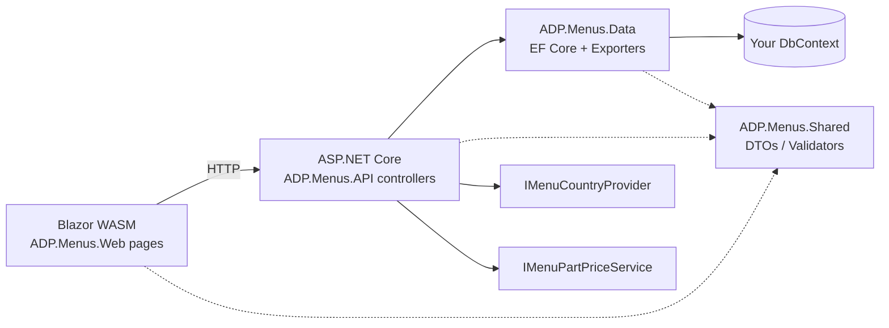
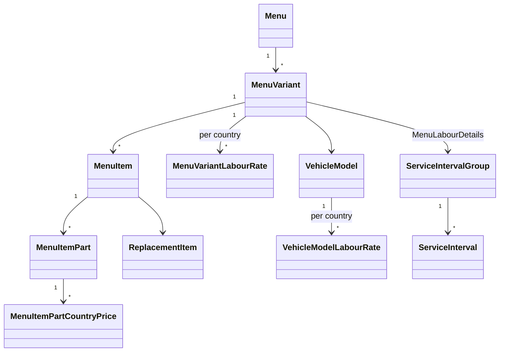
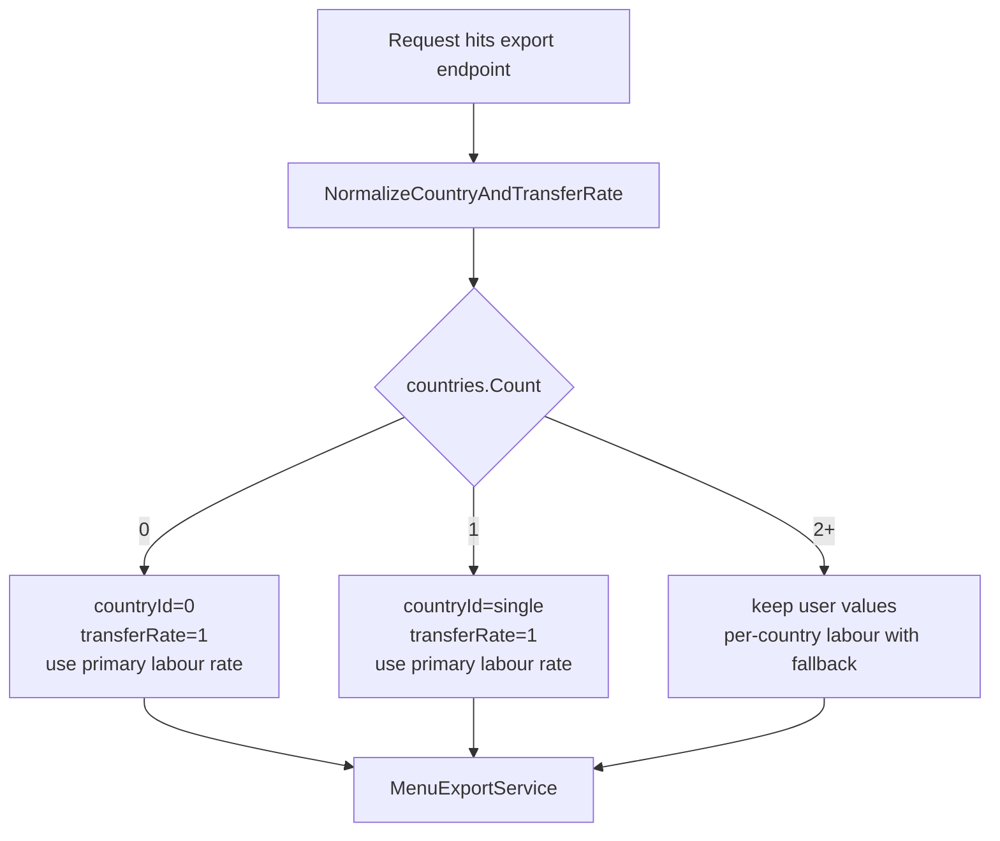

# Integration

How to plug the ADP.Menus package into a Shift-based ASP.NET Core API and Blazor WebAssembly app.

## Packages

| Package | Purpose |
|---|---|
| `ShiftSoftware.ADP.Menus.Shared` | DTOs, validators, action tree, country/language contracts |
| `ShiftSoftware.ADP.Menus.Data` | EF Core entities, AutoMapper profiles, export services |
| `ShiftSoftware.ADP.Menus.API` | ASP.NET Core controllers + `AddMenuApiServices` registration |
| `ShiftSoftware.ADP.Menus.Web` | Blazor WebAssembly pages + `AddMenuBlazorServices` registration |

All packages target **.NET 10**.

## Architecture



The consumer app supplies three things: a **DbContext**, an **`IMenuCountryProvider`**, and an **`IMenuPartPriceService`** (stock lookup). Everything else is in the box.

## Installation

```bash
dotnet add package ShiftSoftware.ADP.Menus.API     # in your API project
dotnet add package ShiftSoftware.ADP.Menus.Web     # in your Blazor WASM project
```

`ADP.Menus.Data` and `ADP.Menus.Shared` come in transitively.

## Registration — API side

### 1. Implement `IMenuCountryProvider`

```csharp
public class CountryProvider : IMenuCountryProvider
{
    public ValueTask<IReadOnlyList<CountryInfo>> GetSupportedCountriesAsync() =>
        ValueTask.FromResult<IReadOnlyList<CountryInfo>>(new[]
        {
            new CountryInfo { Id = 3, Name = "Uzbekistan" },
            new CountryInfo { Id = 4, Name = "Turkmenistan" },
        });
}
```

The package adapts its UI and exports to the **size** of this list — see [Country modes](#country-modes-0--1--n) below.

### 2. Wire it up in `Program.cs`

```csharp
builder.Services.AddSingleton<IMenuCountryProvider, CountryProvider>();
builder.Services.AddScoped<IMenuPartPriceService, MyStockService>();

var mvc = builder.Services.AddControllers(/* ... */).AddShiftEntityWeb(/* ... */);

builder.Services.AddMenuApiServices<DB>(mvc, options =>
{
    options.RoutePrefix = "api";                        // default "api"
    options.EnableMenuActionTreeAuthorization = false;  // turn on to gate by TypeAuth
    options.ApplyMenuPrefixPostfixToStandalones = false; // when true, the variant's MenuPrefix/MenuPostfix
                                                         // are also applied to standalone menu codes during
                                                         // export. Periodic codes always include them.
    options.Languages = new()
    {
        new MenuLanguageOption("en-US", "English"),
        new MenuLanguageOption("ar-IQ", "Arabic"),
    };
});
```

**One call does it all.** `AddMenuApiServices<TDbContext>` internally registers:

- Controllers, AutoMapper profiles, validators, and export services
- `MenuActionTree` with TypeAuth (`services.Configure<TypeAuthAspNetCoreOptions>`)
- Data and AutoMapper assemblies with ShiftEntity (`services.Configure<ShiftEntityOptions>`)
- EF Core entity configuration via `IModelBuildingContributor` — no `modelBuilder.ConfigureMenuEntities()` needed in your DbContext

Your DbContext stays clean:

```csharp
public class DB : ShiftDbContext
{
    public DbSet<TodoItem> TodoItems { get; set; } = default!;
    public DB(DbContextOptions<DB> options) : base(options) { }
}
```

## Registration — Blazor WASM side

```csharp
// Program.cs of your Blazor WASM app
builder.Services.AddSingleton<IMenuCountryProvider, CountryProvider>();

builder.Services.AddMenuBlazorServices(options =>
{
    options.EnableMenuActionTreeAuthorization = false;
    options.IdentityApiUrl = "https://identity.example.com"; // base URL of the ShiftIdentity API,
                                                             // used by Menu list/form pages to
                                                             // look up brands
    options.Layout = typeof(ShiftMainLayout);                // optional: use a custom layout for
                                                             // Menu pages (defaults to built-in MenuLayout)
    options.Languages = new()
    {
        new MenuLanguageOption("en-US", "English"),
        new MenuLanguageOption("ar-IQ", "Arabic"),
    };
});
```

**One call does it all.** `AddMenuBlazorServices` internally registers:

- Menu web services and auth helper
- `MenuActionTree` with TypeAuth (`services.Configure<TypeAuthBlazorOptions>`)
- ADP.Menus.Web routing assembly with ShiftBlazor (`services.Configure<AppStartupOptions>`) — no manual `AdditionalAssemblies` entry needed in your `App.razor.cs`

Menu pages auto-register at the `/Menu` prefix. Add navigation entries pointing to e.g. `/Menu/MenuList`, `/Menu/VehicleModelList`, `/Menu/MenuExport`.

### Layout option

By default, Menu pages use the built-in `MenuLayout` which includes a sidebar drawer with Menu navigation links. To use the consumer app's own layout instead:

```csharp
options.Layout = typeof(MyAppLayout);
```

When `Layout` is null (the default), the built-in `MenuLayout` is used.

## Pages and endpoints

### Blazor pages (prefix `/Menu`)

| Route | Purpose |
|---|---|
| `/Menu/MenuList` | List menus, launch exports |
| `/Menu/MenuForm/{Key?}` | Create/edit a menu and its variants |
| `/Menu/MenuExport` | Export menus to Excel |
| `/Menu/MenuDetailReport` | Menu detail change report |
| `/Menu/VehicleModelList` · `/VehicleModelForm/{Key?}` | Vehicle models + per-country labour rates |
| `/Menu/ReplacementItemList` · `/ReplacementItemForm/{Key?}` | Service items (oil filter, battery…) |
| `/Menu/ServiceIntervalList` · `/ServiceIntervalGroupList` | 10K/20K/… milestones and labour groups |
| `/Menu/BrandMappingList` · `/LabourRateMappingList` | Mappings to RTS codes |
| `/Menu/StandaloneReplacementItemGroupList` | Standalone item groups |

### API controllers (prefix from `MenuApiOptions.RoutePrefix`)

`MenuController`, `MenuVariantController`, `MenuVersionController`, `VehicleModelController`, `ReplacementItemController`, `ServiceIntervalController`, `ServiceIntervalGroupController`, `BrandMappingController`, `LabourRateMappingController`, `StandaloneReplacementItemGroupController` — all standard ShiftEntity CRUD plus:

| Endpoint | Purpose |
|---|---|
| `GET  {prefix}/Menu/ExportMenusToExcel` | Excel export of menus (parts + labour) |
| `GET  {prefix}/Menu/ExportRTSCodesToExcel` | RTS code export |
| `GET  {prefix}/Menu/MenuDetailReportExcel` | Detail change report |
| `GET  {prefix}/Menu/StockByPartNumber/{partNumber}` | Single part stock lookup |
| `POST {prefix}/Menu/UpdatePartsPrice` | Bulk price update |
| `GET  {prefix}/MenuVariant/ByMenu/{menuID}` | Variants of a menu |
| `GET  {prefix}/VehicleModel/GetById/{key}` | Vehicle model with labour structure |

## Domain model



`MenuVariant.LabourRate` is the **primary** rate. `MenuVariantLabourRate` rows are **country-specific overrides** used only when more than one country is configured.

## Country modes (0 / 1 / N)

The Menu package adapts to whatever `IMenuCountryProvider` returns:

| Countries | Country selector | Per-country labour table | Transfer rate input | Stored `CountryID` | Export labour rate | Export transfer rate |
|---|---|---|---|---|---|---|
| **0** (empty/null) | hidden | hidden | hidden, forced `1` | `0` | primary (`MenuVariant.LabourRate`) | server forces `1` |
| **1** | hidden | hidden | hidden, forced `1` | the single id | primary | server forces `1` |
| **N (≥2)** | shown | shown | shown | user-selected | per-country (with primary fallback) | user value |

The `transferRate = 1` and `countryId` overrides are enforced **server-side** in `MenuController` — a stale UI or hand-crafted API call cannot bypass them.



## Authorization (optional)

Set `EnableMenuActionTreeAuthorization = true` in both API and Web options. `MenuActionTree` is registered automatically by `AddMenuApiServices` / `AddMenuBlazorServices` — you do **not** need to add it to your `AddTypeAuth` block. Available nodes:

- **Entity:** `Menus`, `MenuVariants`, `MenuVersions`, `VehicleModels`, `ReplacementItems`, `ServiceIntervals`, `ServiceIntervalGroups`, `BrandMappings`, `LabourRateMappings`, `StandaloneReplacementItemGroups` (each `Read/Write/Delete`)
- **Operations:** `CreateMenuVersion`, `UpdatePartsPrice`
- **Reports:** `ExportMenusToExcel`, `ExportRTSCodesToExcel`, `ExportMenuDetailReport`

All Menu list pages, form pages, and navigation links are wired with `TypeAuthAction` so the UI automatically hides elements the user doesn't have permission for.

When disabled (default), all checks pass — you can adopt authorization later without code changes.

## Sample app

A working end-to-end sample lives under `ADP.Menus/samples/ADP.Menus.Sample.API` and `ADP.Menus.Sample.Web` in the ADP repo. It hosts ShiftIdentity internally (login with `SuperUser` / `OneTwo`) and seeds demo data on startup. Change the return value of `CountryProvider.GetSupportedCountriesAsync` (empty / one / many) to see all three country modes in action.
