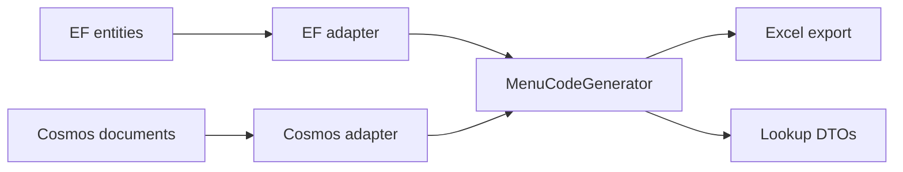

# Service Menu Lookup

The read half of [Cosmos Replication](cosmos-replication.md). Replication projects the menu catalog into
Cosmos; this turns a **basic model code** into the **menu codes, labour codes and prices** for every service
that model's menu offers.

The codes it serves are the codes the dealer's DMS received — not because two implementations are kept in
step, but because there is only one. The DMS export and this lookup call the same generator over the same
contract; each supplies its own data.



## Registering it

`AddLookupService` registers the menu lookup for you — service menus are part of the vehicle lookup result
(see [In the vehicle lookup](#in-the-vehicle-lookup)) — and configuring it is part of the same call:

```csharp
services.AddLookupService(options =>
{
    options.CosmosDatabaseNameSuffix = "-alt";

    options.ConfigureServiceMenu = menu =>
    {
        menu.DefaultCountryID = 2;
    };
});
```

!!! warning "Configure it, or accept the defaults"
    Registering happens whether you configure or not, and the defaults are country `0` with no
    `CountrySettingsResolver`. For a **single-country deployment that is the wrong money** — it charges a
    country labour rate where the DMS export charges the variant's primary one. See
    [Country, transfer rate and labour rate](#country-transfer-rate-and-labour-rate).

For menus **without** the vehicle lookup, register them directly:

```csharp
services.AddServiceMenuLookup(options =>
{
    options.DefaultCountryID = 2;
});
```

That registers `ServiceMenuLookupService` and its dependencies against the registered `CosmosClient`. Use
`AddServiceMenuLookup<TCosmosClient>` when the host keeps more than one client. Everything registers with
`TryAdd`, so the two calls compose in either order and you still get one registration — both are `Configure`
steps on the same options builder, applied in registration order.

!!! note "Registering costs a deployment nothing until it opts in"
    Nothing in the registration touches Cosmos, and a vehicle lookup only reads the menu when the request
    sets `ServiceMenuOptions.Include`. A deployment that never provisioned the menu containers is unaffected —
    and if it does opt in without provisioning, the section reports `Unavailable` rather than failing the
    lookup.

`ConfigureServiceMenu` is an `Action<ServiceMenuLookupOptions>`, not a settings object held on
`LookupOptions`. That is deliberate: it becomes one more `Configure` step on the same options builder, so it
composes with everything else instead of giving the menu settings a second home to merge. It also keeps the
path below working — `LookupOptions` is built before DI exists, so an instance there could never carry a
resolver made from the host's own services.

```csharp
services.AddOptions<ServiceMenuLookupOptions>()
        .Configure<ICountryProvider>((options, countries) => …);
```

`AddLookupService` also seeds `ServiceMenuLookupOptions.CosmosDatabaseNameSuffix` from
`LookupOptions.CosmosDatabaseNameSuffix`, so a dev pointing the whole lookup at suffixed databases gets the
menu containers too. An explicit menu suffix — from `ConfigureServiceMenu` or `AddServiceMenuLookup` — still
wins.

## Using it

```csharp
var menu = await serviceMenuLookupService.GetMenuAsync("ABC12", language: "en");

foreach (var variant in menu.Variants)
    foreach (var service in variant.PeriodicServices)
        Console.WriteLine($"{service.ServiceIntervalValueInMeter}m  {service.Code}  {service.TotalPrice}");
```

The fuller form takes a request:

```csharp
var menu = await serviceMenuLookupService.GetMenuAsync(new ServiceMenuLookupRequest
{
    BasicModelCode = "ABC12",
    CountryID = 2,          // selects part prices and the labour rate
    Language = "en",
});
```

One call generates **one language and one country**. To show several languages, call again and correlate the
results by `LineKey` — never by `Code`, which is language-dependent by construction.

**Every live variant of the model comes back**, and the caller picks. There is no variant filter *by id* on
the request: a variant id is a primary key inside the menus database and nothing outside it holds one. Each
`ServiceMenuVariantDTO` carries its id and authored name so a UI can present the choice.

### Free menus

A variant can be authored **free of charge** (the *Free Menu* flag on the Menu tab of a menu variant). That
travels through replication to `ServiceMenuVariantDTO.IsFree` on the nested shape and to
`VehicleServiceMenuLineDTO.IsFree` on every line of the flat one.

`FreeFilter` narrows a request to one kind or the other:

```csharp
var freeMenus = await serviceMenuLookupService.GetMenuAsync(new ServiceMenuLookupRequest
{
    BasicModelCode = "ABC12",
    Language = "en",
    FreeFilter = ServiceMenuFreeFilter.FreeOnly,   // All (default) | FreeOnly | PaidOnly
});
```

The same option exists on `VehicleServiceMenuRequestOptions` for the VIN path. It selects **variants** — a
variant it excludes contributes neither its scheduled nor its standalone services — and it is applied before
generation, so an excluded variant costs nothing to skip.

!!! warning "The flag does not change any price"
    Nothing zeroes a total for a free variant: `LabourTotalPrice`, `PartsTotalPrice` and `TotalPrice` are
    generated exactly as they are for any other variant, and the DMS export's figures are untouched. Read
    `IsFree` and render *"free"* instead of the total — a UI that prints the total verbatim quotes a customer
    for a menu the catalogue calls free.

A filter that excludes every variant returns **no variants with `NotFound = false`** (and, on the vehicle
lookup, `Status = Found` with no services). That is not the same as a model with no menu — the menu exists,
and this request asked for a part of it that is empty.

### What comes back

`ServiceMenuLookupDTO` → `Variants` → `PeriodicServices` (scheduled, ordered by distance) and
`StandaloneServices` (sold on their own). Each line carries:

| Group | Fields |
|---|---|
| Codes | `Code`, `LabourCode`, `Description`, `LineKey`, `LineType` |
| Interval | `ServiceIntervalCode`, `ServiceIntervalValueInMeter` (scheduled lines only) |
| Labour | `LabourRate`, `AllowedTime`, `LabourPrice`, `Consumable`, `LabourTotalPrice` |
| Parts | `Parts[]` (`PartNumber`, `Quantity`, `UnitPrice`, `TotalPrice`, `HasCountryPrice`), `PartsTotalPrice` |
| Total | `DiscountPercentage`, `DiscountAmount`, `TotalPrice` |

The variant carries `VariantID`, `VariantName`, `BrandID`, `BrandCode`, `DiscountPercentage` and `IsFree`.
On the vehicle lookup's flat shape those variant-level fields travel on each line instead, since there is no
variant object to hang them on.

!!! info "Dealer cost is not here, and cannot be"
    Cost, margin and profit belong to the DMS export. The generator only populates cost when a caller asks
    for it, and the lookup never does — so it is absent from the object graph rather than stripped from the
    output, and the lookup DTOs have nowhere to put it.

`NotFound` distinguishes **"this model has no menu"** (nothing replicated under that model code) from a menu
that exists but produces no lines — every variant deleted, or intervals whose groups carry no labour detail.
A UI usually renders those two differently.

`HasUnpricedParts` marks a line whose total is understated: at least one part had no price row for the
requested country, so it was priced 0 rather than dropped. Worth surfacing before quoting the total to a
customer.

!!! warning "`ServiceIntervalValueInMeter` is in kilometres"
    The name is the source column's (`ServiceInterval.ValueInMeter`) and is not a unit — the catalogue
    authors `20000` there for the interval it also names *"20,000 KM"*. Render it as it is; dividing by
    1000 quotes a 20,000 km service as 20 km.

## In the vehicle lookup

A VIN lookup can carry the model's menu with it. This is the same read and the same generator; what it adds
is a **join**, from the vehicle to the catalog.

```csharp
var vehicle = await vehicleLookupService.LookupAsync(vin, new VehicleLookupRequestOptions
{
    LanguageCode = "en",
    ServiceMenuOptions = new VehicleServiceMenuRequestOptions
    {
        Include = true,        // the switch; everything below is optional
        CountryID = 2,
        TransferRate = 1.15m,
        FreeFilter = ServiceMenuFreeFilter.All,   // All | FreeOnly | PaidOnly
    },
});

foreach (var service in vehicle.ServiceMenu.Services)
    Console.WriteLine($"{service.VariantName}  {service.Code}  {service.TotalPrice}");
```

`VehicleLookupDTO.ServiceMenu` is null unless the request asked for it. It is **opt-in per request**, not
per deployment, because it costs an extra single-partition read and a fold *per vehicle* — a bulk lookup
would otherwise pay it once per VIN.

`Include = true` on its own is the common call: it generates in the request's language, for the menu
options' default country, at transfer rate 1. A null `ServiceMenuOptions` and `Include = false` both mean no
menu — the switch sits beside the settings it governs so the two cannot disagree, which is what stops a
caller setting a country and having it silently ignored.

The menu's **language** is deliberately not in there: it is `LanguageCode`, because a vehicle lookup
rendering in one language with menu codes in another would be a bug.

!!! warning "`TransferRate` moves money, and the caller wins"
    A transfer rate supplied here overrides the host's `CountrySettingsResolver` — an explicit value is
    honoured rather than silently replaced. It scales the consumable, so it changes the price quoted to a
    customer; it changes no menu or labour **code**, because the labour-rate mapping is always keyed by the
    variant's primary rate. An endpoint that binds this straight from a query string is letting its callers
    move the quoted price. A host serving a public web component should fix it server-side, or leave it null
    and let the resolver decide.

The services arrive **flat**: one list, each line carrying its `VariantID` and `VariantName`, in the nested
shape's order (per variant, scheduled by distance, then standalone). A caller that started from a VIN wants
a list it can render; grouping is one `GroupBy` away if it wants the nested shape back.

### The join is on a derived key, and it can miss

`VehicleLookupDTO.BasicModelCode` is reduced from the vehicle's Katashiki — first segment before the
hyphen, trailing `L`/`R` removed past five characters. The catalog's `BasicModelCode` is typed by an author.
Nothing guarantees the two agree, and a miss is an ordinary outcome rather than an error.

`ServiceMenu.Status` is what tells them apart, and it is the instrument for measuring how often the join
lands:

| `Status` | Meaning | What to do |
|---|---|---|
| `Found` | a menu exists for the derived code | — (`Services` can still be empty; see below) |
| `NotFound` | the derived code matched no menu | either nobody authored one, or the codes disagree |
| `NoBasicModelCode` | the vehicle has no Katashiki | not a miss — there was no key to join on |
| `Unavailable` | the menu lookup could not be consulted | provision the containers, then sweep |
| `NotRegistered` | the menu lookup is not registered | call `AddServiceMenuLookup` (or `AddLookupService`) |

**Hit rate = `Found / (Found + NotFound)`.** Log `Status` alongside the VIN and the code that was tried
(`ServiceMenu.BasicModelCode` is echoed even on a miss) and the rate falls out. `NoBasicModelCode` is
excluded from both sides on purpose: a vehicle with no Katashiki is not evidence about the codes.

`Found` with an empty `Services` list is a menu that exists but generates nothing — every variant deleted,
or intervals whose groups carry no labour detail. A UI usually renders that differently from "no menu".

### A menu fault never fails the VIN lookup

Everything the menu subsystem can raise — an unprovisioned container, documents referencing master data
they do not carry, a Cosmos read failure — is contained and reported as `Unavailable`. A section that is
additive must not be able to take down a lookup that has nothing to do with menus.

Containment stops there. A bug in the lookup itself, **or in your `CountrySettingsResolver`**, propagates:
a section that is quietly "unavailable" forever is a worse failure than a loud one. That resolver now runs
inside the VIN lookup — keep it total.

`ServiceMenuLookupService.GetMenuAsync` is unchanged and still throws. A caller asking for a menu and
nothing else *should* hear about a provisioning fault; a caller asking about a vehicle should not.

## Country, transfer rate and labour rate

A menus host normalises two settings from its configured country list before exporting: a deployment with
**zero or one** configured country exports at transfer rate 1 using the variant's **primary** labour rate,
and only a multi-country deployment charges per-country rates. That configuration lives in the menus host, so
the lookup cannot read it — wire the resolver to supply the same answer.

No option here takes an `IServiceProvider`. When the resolver needs the host's own services, configure it
*with* them — that is what the options pattern is for:

```csharp
services.AddServiceMenuLookup();

services.AddOptions<ServiceMenuLookupOptions>()
        .Configure<ICountryProvider>((options, countries) =>
        {
            options.DefaultCountryID = 2;

            options.CountrySettingsResolver = async countryID =>
            {
                var configured = await countries.GetSupportedCountriesAsync();

                return new ServiceMenuCountrySettings
                {
                    TransferRate = configured.Count > 1 ? await countries.GetTransferRateAsync(countryID) : 1m,
                    UsePrimaryLabourRate = configured.Count <= 1,
                };
            };
        });
```

Leaving it unset uses the request's transfer rate (default 1) and per-country labour rates — correct for a
multi-country deployment. **Generated menu and labour codes are unaffected either way**: the labour-rate
mapping that feeds the labour code is always keyed by the variant's primary rate, never the country one. Only
the money on the line moves.

The resolver's transfer rate is a **default, not a veto**: a request that supplies its own wins over it. The
labour-rate mode has no request counterpart, so that half is always the host's.

| Setting | Precedence |
|---|---|
| Country | request → `DefaultCountryID` → `0` |
| Transfer rate | request → `CountrySettingsResolver` → `1` |
| Labour-rate mode | `CountrySettingsResolver` → per-country rates |

A host that wants the resolver to be the only authority over the transfer rate simply does not expose the
field to its callers — the lookup honours what it is given rather than second-guessing it.

## Cost of a lookup

One single-partition query, then a pure in-memory fold. The documents are fully denormalized, so there is no
reference cache, no second round trip and no staleness window on the read side — keeping the embedded master
data fresh is replication's job.

The fold runs per lookup. That is cheap for one model; a caller iterating over many models should cache its
own results rather than expecting the service to, since a cache here would need an invalidation story that
replication deliberately does not provide.

## Failure modes

| Condition | Behaviour |
|---|---|
| Model has no menu documents | `NotFound = true`, no variants — not an exception |
| Container not provisioned | `ServiceMenuContainerNotFoundException` |
| Documents reference master data they do not carry | `ServiceMenuGenerationException` |
| Partition missing a whole document type | **degrades silently** — see below |

The first is an ordinary answer. The second is a provisioning fault and is raised rather than reported as an
empty menu, because otherwise an unprovisioned deployment says "no menu" for every model, permanently. The
third preserves the export's own fail-loud behaviour on a missing labour-rate mapping — softening it would
mean issuing a code composed from data that is not there.

!!! warning "A partition missing a document type loses lines quietly"
    Without `MenuLabour` documents there is nothing to match an interval against, so **every scheduled line
    disappears with no error** — the same way a missing `Include` loses lines on the export side. If a model
    returns standalone services but no scheduled ones, suspect incomplete replication before suspecting the
    catalog: run a full `updateAll: true` sweep and check `MenuReplicationStatus`.

## What a soft delete does to a menu

A soft-deleted row is excluded from generated menus — on **both** paths. Each adapter filters deleted rows on
the way in, so the generator only ever sees live data. The two filters are kept in step by a test that
soft-deletes one row of each table in turn and asserts the export and the lookup still produce identical
output.

| Soft-deleted row | Effect on the menu |
|---|---|
| Menu variant, or its parent menu | the whole variant disappears |
| Periodic availability | that scheduled service disappears |
| Service interval | that scheduled service disappears |
| Labour detail, or its interval group | the scheduled services it supplied disappear |
| Menu item, replacement-item link, or the replacement item itself | that item contributes nothing — no standalone line, no parts on scheduled lines |
| Part, part country price, country labour rate | that row is excluded |
| Standalone item group | the group disappears and its items fall back to **individual standalone lines** |

That last row is the one judgement call. Deleting a *grouping* withdraws the grouping, not the items — they
are separate rows, still sellable, and still carry their own operation and labour codes — so they revert to
selling individually rather than vanishing.

!!! note "Soft-deleted rows are still replicated to Cosmos"
    Replication carries them, flag and all. It has to: only a **hard** delete removes a document, so skipping
    a soft-deleted row would leave the document already in Cosmos untouched and stale, still generating its
    line. Carrying the flag is what makes the delete take effect.

## Rendering it

There is no ADP web component for the service menu — rendering is the host's. The response is shaped for it:
`Services` is a flat list in display order (per variant, scheduled by odometer reading, then standalone), and
each line carries its variant so a UI can group client-side. `VehicleServiceMenuLineDTO` and
`VehicleServiceMenuPartDTO` are generated into the NPM package's TypeScript types alongside the rest of the
vehicle lookup, so a TS front end gets the shape for free.

Three things a renderer should get right:

- **Word each `Status` differently.** Collapsing all of them into "no data" throws away the only signal that
  separates "no menu published for this model" from "the menu subsystem is misconfigured".
- **Mark a line with `HasUnpricedParts`, do not quote it clean.** A part with no price row for the country is
  priced 0 rather than dropped, so the total is understated. Quoting it as if it were complete is the failure
  that flag exists to prevent.
- **Do not divide `ServiceIntervalValueInMeter` by 1000.** It is already kilometres, whatever the name says.

## Sample

[`samples/ADP.Menus.Sample.Functions`](https://github.com/ShiftSoftware/ADP/tree/master/ADP.Menus/samples/ADP.Menus.Sample.Functions)
is the full round trip in one host: it replicates the catalogue into Cosmos (hourly timers plus
`POST api/replicate-all`) and reads it back two ways.

| Endpoint | What it shows |
|---|---|
| `GET api/menu/{basicModelCode}` | the read path — codes, labour codes and prices for a model you name |
| `GET api/vehicle/{vin}` | the **join** — Katashiki → derived code → `status`, with the menu attached |

`MenuReplication.http` has all of them ready to run: replicate, check the status, then look the model up and
compare the codes against the DMS export.

!!! note "The vehicle endpoint needs containers the sample does not provision"
    Menu replication fills the `Services` database; a vehicle lookup reads `CompanyData`/`Vehicles`, which
    comes from a different pipeline entirely. Against a menus-only emulator `GET api/vehicle/{vin}` answers
    503 and says so. The menu endpoint needs only the menu containers and always works.
