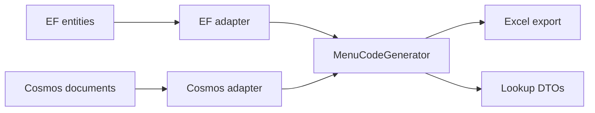

# Service Menu Lookup

The read half of [Cosmos Replication](cosmos-replication.md). Replication projects the menu catalog into
Cosmos; this turns a **basic model code** into the **menu codes, labour codes and prices** for every service
that model's menu offers.

The codes it serves are the codes the dealer's DMS received — not because two implementations are kept in
step, but because there is only one. The DMS export and this lookup call the same generator over the same
contract; each supplies its own data.



## Registering it

Service menus are their own registration with their own options, because they are a self-contained feature
over their own Cosmos containers — a host can want menus without the vehicle lookup, or the vehicle lookup
without menus.

```csharp
services.AddServiceMenuLookup(options =>
{
    options.DefaultCountryID = 2;
});
```

That is all a host needs: it registers `ServiceMenuLookupService` and its dependencies against the
registered `CosmosClient`. Use `AddServiceMenuLookup<TCosmosClient>` when the host keeps more than one
client. Everything registers with `TryAdd`, so calling it twice is harmless.

!!! note "The general lookup registration does not include it yet"
    `AddLookupService` deliberately does **not** register the menu lookup today — a host opts in above. It
    will register it once service menus become part of the vehicle lookup result, so that a deployment
    which never provisioned the menu containers is not affected until it chooses to be.

## Using it

```csharp
var menu = await serviceMenuLookupService.GetMenuAsync("ABC12", language: "en");

foreach (var variant in menu.Variants)
    foreach (var service in variant.PeriodicServices)
        Console.WriteLine($"{service.ServiceIntervalValueInMeter}m  {service.Code}  {service.TotalPrice}");
```

The fuller form takes a request:

```csharp
var menu = await serviceMenuLookupService.GetMenuAsync(new ServiceMenuLookupRequest
{
    BasicModelCode = "ABC12",
    CountryID = 2,          // selects part prices and the labour rate
    Language = "en",
});
```

One call generates **one language and one country**. To show several languages, call again and correlate the
results by `LineKey` — never by `Code`, which is language-dependent by construction.

**Every live variant of the model comes back**, and the caller picks. There is no variant filter on the
request: a variant id is a primary key inside the menus database and nothing outside it holds one. Each
`ServiceMenuVariantDTO` carries its id and authored name so a UI can present the choice.

### What comes back

`ServiceMenuLookupDTO` → `Variants` → `PeriodicServices` (scheduled, ordered by distance) and
`StandaloneServices` (sold on their own). Each line carries:

| Group | Fields |
|---|---|
| Codes | `Code`, `LabourCode`, `Description`, `LineKey`, `LineType` |
| Interval | `ServiceIntervalCode`, `ServiceIntervalValueInMeter` (scheduled lines only) |
| Labour | `LabourRate`, `AllowedTime`, `LabourPrice`, `Consumable`, `LabourTotalPrice` |
| Parts | `Parts[]` (`PartNumber`, `Quantity`, `UnitPrice`, `TotalPrice`, `HasCountryPrice`), `PartsTotalPrice` |
| Total | `DiscountPercentage`, `DiscountAmount`, `TotalPrice` |

!!! info "Dealer cost is not here, and cannot be"
    Cost, margin and profit belong to the DMS export. The generator only populates cost when a caller asks
    for it, and the lookup never does — so it is absent from the object graph rather than stripped from the
    output, and the lookup DTOs have nowhere to put it.

`NotFound` distinguishes **"this model has no menu"** (nothing replicated under that model code) from a menu
that exists but produces no lines — every variant deleted, or intervals whose groups carry no labour detail.
A UI usually renders those two differently.

`HasUnpricedParts` marks a line whose total is understated: at least one part had no price row for the
requested country, so it was priced 0 rather than dropped. Worth surfacing before quoting the total to a
customer.

## Country, transfer rate and labour rate

A menus host normalises two settings from its configured country list before exporting: a deployment with
**zero or one** configured country exports at transfer rate 1 using the variant's **primary** labour rate,
and only a multi-country deployment charges per-country rates. That configuration lives in the menus host, so
the lookup cannot read it — wire the resolver to supply the same answer.

No option here takes an `IServiceProvider`. When the resolver needs the host's own services, configure it
*with* them — that is what the options pattern is for:

```csharp
services.AddServiceMenuLookup();

services.AddOptions<ServiceMenuLookupOptions>()
        .Configure<ICountryProvider>((options, countries) =>
        {
            options.DefaultCountryID = 2;

            options.CountrySettingsResolver = async countryID =>
            {
                var configured = await countries.GetSupportedCountriesAsync();

                return new ServiceMenuCountrySettings
                {
                    TransferRate = configured.Count > 1 ? await countries.GetTransferRateAsync(countryID) : 1m,
                    UsePrimaryLabourRate = configured.Count <= 1,
                };
            };
        });
```

Leaving it unset uses the request's transfer rate (default 1) and per-country labour rates — correct for a
multi-country deployment. **Generated menu and labour codes are unaffected either way**: the labour-rate
mapping that feeds the labour code is always keyed by the variant's primary rate, never the country one. Only
the money on the line moves.

## Cost of a lookup

One single-partition query, then a pure in-memory fold. The documents are fully denormalized, so there is no
reference cache, no second round trip and no staleness window on the read side — keeping the embedded master
data fresh is replication's job.

The fold runs per lookup. That is cheap for one model; a caller iterating over many models should cache its
own results rather than expecting the service to, since a cache here would need an invalidation story that
replication deliberately does not provide.

## Failure modes

| Condition | Behaviour |
|---|---|
| Model has no menu documents | `NotFound = true`, no variants — not an exception |
| Container not provisioned | `ServiceMenuContainerNotFoundException` |
| Documents reference master data they do not carry | `ServiceMenuGenerationException` |
| Partition missing a whole document type | **degrades silently** — see below |

The first is an ordinary answer. The second is a provisioning fault and is raised rather than reported as an
empty menu, because otherwise an unprovisioned deployment says "no menu" for every model, permanently. The
third preserves the export's own fail-loud behaviour on a missing labour-rate mapping — softening it would
mean issuing a code composed from data that is not there.

!!! warning "A partition missing a document type loses lines quietly"
    Without `MenuLabour` documents there is nothing to match an interval against, so **every scheduled line
    disappears with no error** — the same way a missing `Include` loses lines on the export side. If a model
    returns standalone services but no scheduled ones, suspect incomplete replication before suspecting the
    catalog: run a full `updateAll: true` sweep and check `MenuReplicationStatus`.

## What a soft delete does to a menu

A soft-deleted row is excluded from generated menus — on **both** paths. Each adapter filters deleted rows on
the way in, so the generator only ever sees live data. The two filters are kept in step by a test that
soft-deletes one row of each table in turn and asserts the export and the lookup still produce identical
output.

| Soft-deleted row | Effect on the menu |
|---|---|
| Menu variant, or its parent menu | the whole variant disappears |
| Periodic availability | that scheduled service disappears |
| Service interval | that scheduled service disappears |
| Labour detail, or its interval group | the scheduled services it supplied disappear |
| Menu item, replacement-item link, or the replacement item itself | that item contributes nothing — no standalone line, no parts on scheduled lines |
| Part, part country price, country labour rate | that row is excluded |
| Standalone item group | the group disappears and its items fall back to **individual standalone lines** |

That last row is the one judgement call. Deleting a *grouping* withdraws the grouping, not the items — they
are separate rows, still sellable, and still carry their own operation and labour codes — so they revert to
selling individually rather than vanishing.

!!! note "Soft-deleted rows are still replicated to Cosmos"
    Replication carries them, flag and all. It has to: only a **hard** delete removes a document, so skipping
    a soft-deleted row would leave the document already in Cosmos untouched and stale, still generating its
    line. Carrying the flag is what makes the delete take effect.

## Sample

[`samples/ADP.Menus.Sample.Functions`](https://github.com/ShiftSoftware/ADP/tree/master/ADP.Menus/samples/ADP.Menus.Sample.Functions)
is the full round trip in one host: it replicates the catalogue into Cosmos (hourly timers plus
`POST api/replicate-all`) and reads it back with `GET api/menu/{basicModelCode}`. `MenuReplication.http`
has all of them ready to run — replicate, check the status, then look the model up and compare the codes
against the DMS export.
