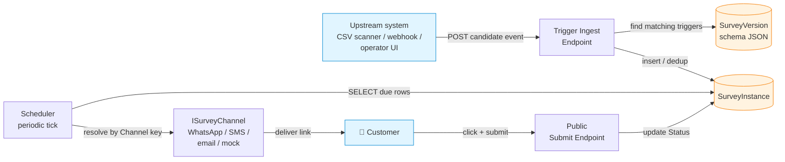
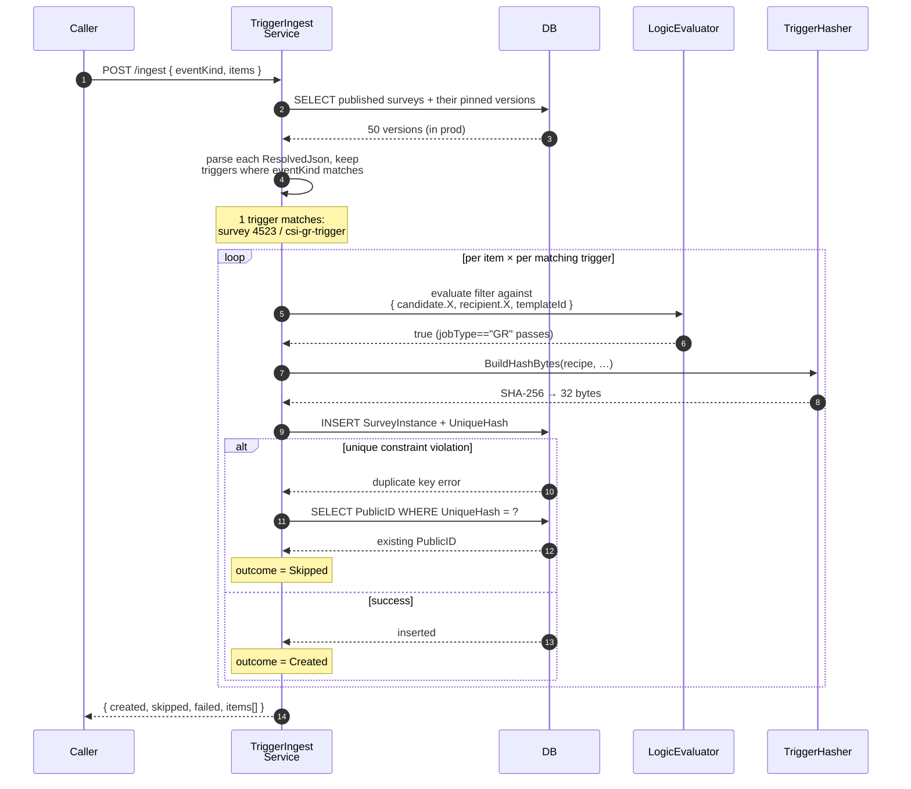
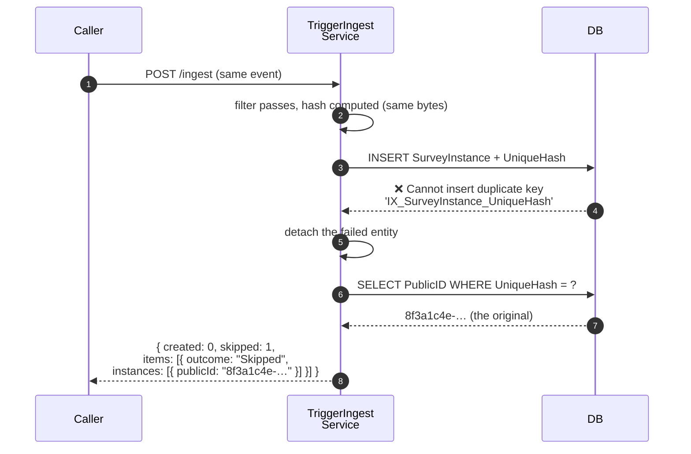
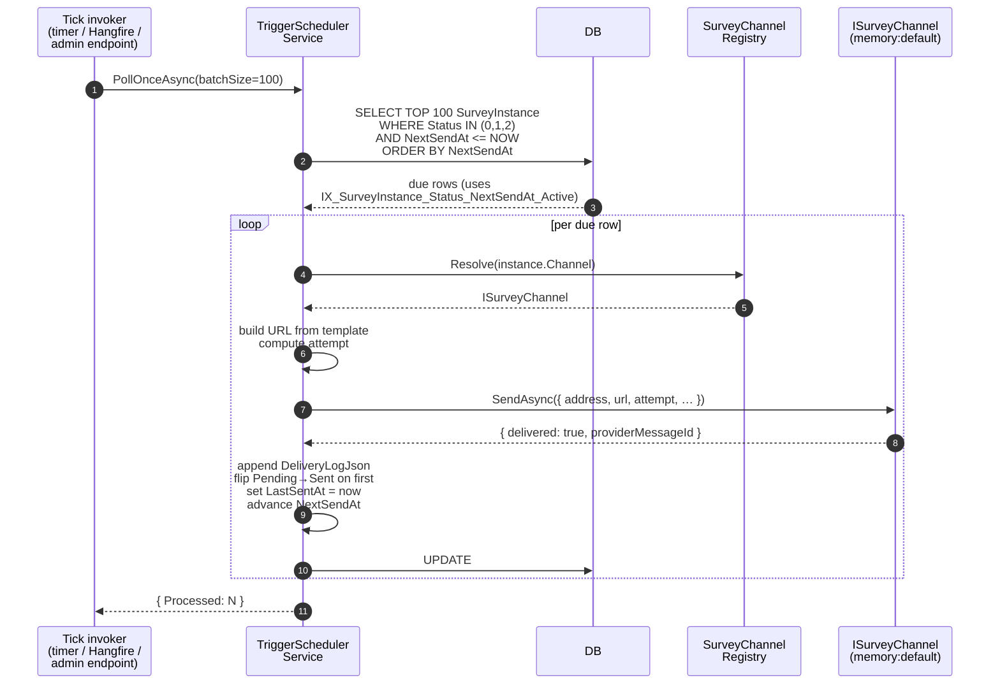
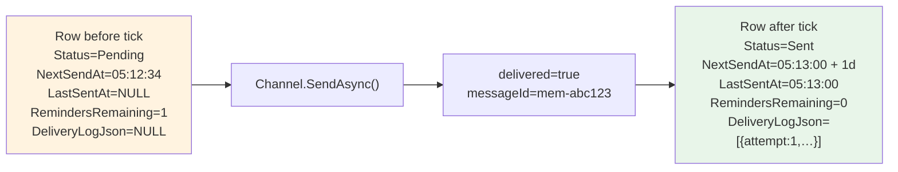
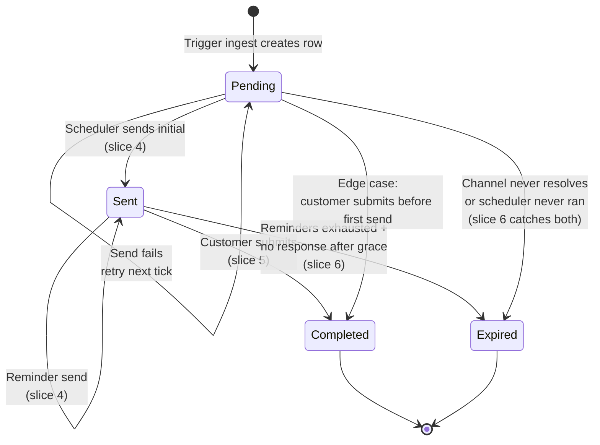
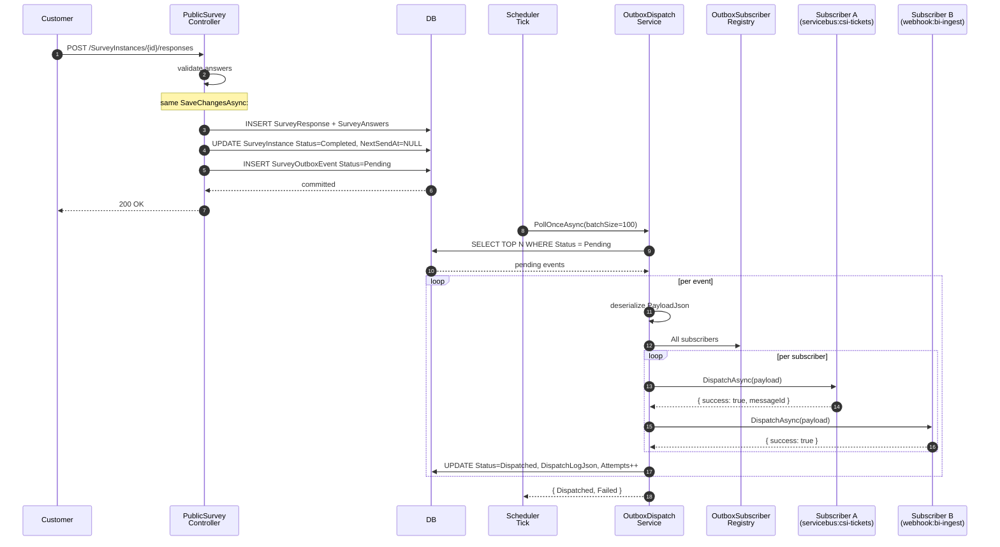
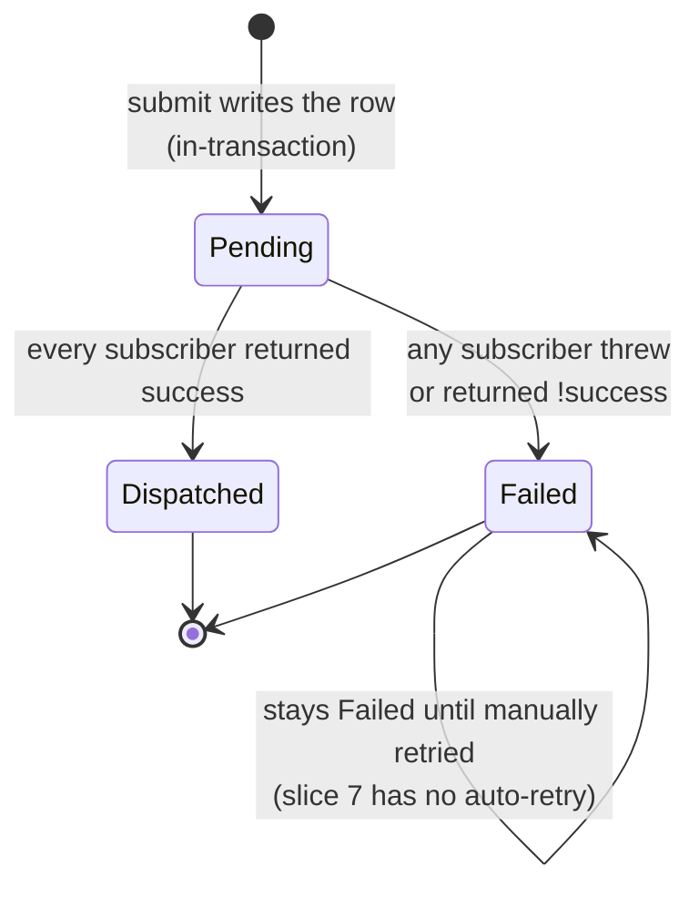

# Triggers & Scheduler

How an upstream business event — a service visit closing, a vehicle invoice posting, an operator pressing "send" on a campaign — turns into a survey link in a customer's hand.

This doc walks through one concrete event end-to-end against a real **CSI-GR** (Customer Satisfaction Index — General Repair) survey configuration. It's the same fixture the e2e harness exercises, so what you read here is what's actually running.

---

## The big picture



Five moving parts:

1. **Upstream system** — anything that knows when a real-world event happened. Could be a Hangfire job in another service scanning a CSV, a webhook from a DMS, a Service Bus consumer, or an operator pressing a button.
2. **Trigger Ingest Endpoint** — `POST /api/Surveys/Triggers/ingest`. Accepts batches of candidate events. Stateless; reads the published-survey schema, writes one `SurveyInstance` per matching `(survey, trigger)` pair.
3. **`SurveyInstance` table** — the source of truth. Every link ever offered to a customer is one row here.
4. **Scheduler** — polls the table on an interval, picks up rows whose `NextSendAt` has elapsed, dispatches via the channel snapshotted on the row.
5. **`ISurveyChannel` implementations** — pluggable transports. The module ships an in-memory mock for tests. Production deployments register WhatsApp / SMS / email implementations under stable keys (`whatsapp:default`, `sms:twilio`, etc.).

---

## The trigger config (what survey authors set up)

Triggers live inside the survey schema as a `triggers[]` array. Here's the CSI-GR fixture:

```jsonc
{
  "id": "csi-gr-trigger",                          // stable handle within this survey
  "enabled": true,                                  // off-switch without removing the config
  "eventKind": "service-visit-closed",              // matches against the ingest payload's eventKind
  "filter": {                                       // optional — same evaluator as navigation logic
    "questionId": "candidate.jobType",
    "op": "==",
    "value": "GR"
  },
  "dedupRecipe": [                                  // hashed → UniqueHash column
    "templateId",
    "recipient.address",
    "candidate.dealerId",
    "candidate.wip"
  ],
  "schedule": {
    "initialDelay": "0d",                           // delay from event timestamp to first send
    "reminders": ["1d"]                             // each entry = delay since previous send
  },
  "channel": "memory:default"                       // DI key resolved at scheduler tick time
}
```

What each field controls:

| Field | Controls |
|---|---|
| `eventKind` | Which `eventKind` ingest calls this trigger responds to. |
| `filter` | Which candidate events of that kind actually produce an instance. Matches against a path-keyed dict (`templateId`, `recipient.X`, `candidate.X`). |
| `dedupRecipe` | The natural key for "have I already produced an instance for this event + recipient." Authors must include the event's identifying fields. |
| `schedule.initialDelay` | How long after the event before the first send fires. Duration string (`0d`, `15m`, `4h`, `2d`). |
| `schedule.reminders` | Each subsequent send delay, measured from the *previous* send. |
| `channel` | Stable DI key. Resolved against registered `ISurveyChannel` implementations at send time. |

!!! tip "Authoring rule of thumb for `dedupRecipe`"
    Always include the event's natural identifier (`candidate.wip` for service visits, `candidate.salesInvoiceNumber` for vehicle sales). Always include `recipient.address`. Always include `templateId`. Anything else only if you have a reason — those three give you "process each event at most once per recipient per survey."

---

## A worked example: one event end-to-end

Let's say the survey has been published. Its DB row:

| Survey.ID | Survey.Name | Survey.PublishedVersionNumber |
|---|---|---|
| `4523` | E2E CSI-GR | `1` |

…with a `SurveyVersion` row carrying the resolved JSON above.

There are no `SurveyInstance` rows yet. Now an upstream service-visit-closed event arrives.

### Step 1 — caller posts to ingest

```http
POST /api/Surveys/Triggers/ingest
Authorization: Bearer …

{
  "eventKind": "service-visit-closed",
  "items": [{
    "payload": {
      "wip": "40956",
      "dealerId": "1",
      "jobType": "GR",
      "VIN": "JTMABBBJ2N4024400",
      "CustomerName": "Kadhem Owaid"
    },
    "recipient": {
      "address": "+964 770 000 0001",
      "locale": "ar",
      "customerRef": "cust-123"
    }
  }]
}
```

### Step 2 — service finds candidate triggers



### Step 3 — building the evaluation context

For the filter to evaluate against an event payload, the service flattens the candidate + recipient into a path-keyed dict:

| Key | Value |
|---|---|
| `templateId` | `4523` |
| `recipient.address` | `"+964 770 000 0001"` |
| `recipient.locale` | `"ar"` |
| `recipient.customerRef` | `"cust-123"` |
| `candidate.wip` | `"40956"` |
| `candidate.dealerId` | `"1"` |
| `candidate.jobType` | `"GR"` |
| `candidate.VIN` | `"JTMABBBJ2N4024400"` |
| `candidate.CustomerName` | `"Kadhem Owaid"` |

The same `LogicEvaluator` that drives navigation rules then runs the filter against this dict. The filter `candidate.jobType == "GR"` returns `true`. (If `jobType` had been `"PM"`, the filter would have returned `false` and the loop would `continue` — no instance created.)

### Step 4 — building the dedup hash

`TriggerHasher.BuildHashBytes` walks the recipe in order, prefixes each path with its name, joins with the unit-separator (``):

```
templateId=4523␟recipient.address=+964 770 000 0001␟candidate.dealerId=1␟candidate.wip=40956
```

Then SHA-256 of those UTF-8 bytes → 32 bytes. Call it `0x3F:E8:11:…:7A`.

!!! info "Why path-prefix the values?"
    Without the `path=` prefix, two recipes that produce the same concatenated value-string would collide. With the prefix, even an empty value (`candidate.X=`) is distinct from an empty value at a different path (`candidate.Y=`). The unit-separator (``) prevents string-content from accidentally bridging slot boundaries.

### Step 5 — the `SurveyInstance` row after INSERT

| Column | Value |
|---|---|
| `ID` | `12345` |
| `PublicID` | `8f3a1c4e-…` (fresh GUID — appears in the customer URL) |
| `SurveyID` | `4523` |
| `SurveyVersionID` | `7` |
| `TriggeredAt` | `2026-05-14 05:12:34` |
| `TriggeredBy` | `event:service-visit-closed` |
| `Status` | `0` (Pending) |
| `CustomerRef` | `cust-123` |
| `MetaDataJson` | `{"wip":"40956","dealerId":"1",...}` *(full candidate payload snapshotted)* |
| `TriggerId` | `csi-gr-trigger` |
| `Channel` | `memory:default` |
| `RecipientAddress` | `+964 770 000 0001` |
| `RecipientLocale` | `ar` |
| `NextSendAt` | `2026-05-14 05:12:34` *(= TriggeredAt + `0d` initialDelay)* |
| `LastSentAt` | `NULL` |
| `RemindersRemaining` | `1` *(one reminder configured)* |
| `DeliveryLogJson` | `NULL` |
| `UniqueHash` | `0x3F:E8:11:…:7A` *(stamped explicitly via `db.Entry(instance).Property("UniqueHash")`)* |

!!! note "About `UniqueHash`"
    The framework's `IEntityHasUniqueHash<T>` adds the `UniqueHash BINARY(32)` column + filtered unique index automatically (`WHERE UniqueHash IS NOT NULL AND IsDeleted = 0`). The auto-hash logic in `ShiftRepository.SetAuditFields` only fires on the per-row save path through `ShiftRepository`. The trigger ingest service goes straight through `db.SaveChangesAsync` — so `CalculateUniqueHash()` returns `null` (opting out of the framework's path) and the service stamps the bytes itself. Same behaviour, manual control.

### Step 6 — the response

```jsonc
{
  "created": 1,
  "skipped": 0,
  "failed": 0,
  "items": [{
    "outcome": "Created",
    "instances": [{
      "surveyId": 4523,
      "triggerId": "csi-gr-trigger",
      "publicId": "8f3a1c4e-…"
    }]
  }]
}
```

---

## Same event posted twice — the dedup path

If the upstream system retries (or the operator clicks twice, or a CSV row gets reprocessed), the second POST hits the same recipe → same hash → same `UniqueHash` bytes. SQL Server rejects the second INSERT.



The caller now knows: *"this event already produced instance `8f3a1c4e-…`."* They can correlate without ever knowing how dedup is implemented.

!!! warning "The dedup recipe is a load-bearing design choice"
    The recipe defines what counts as "the same event." Get it wrong in either direction:

    - **Too narrow** (e.g., omit `candidate.dealerId` for service visits): two dealers' WIP numbers can collide because WIP is per-dealer, not globally unique. You'll miss a legitimate second instance.
    - **Too wide** (e.g., include `candidate.timestamp` to the second): every event always looks new, dedup never fires, customers get retriggered on every replay.

    The natural rule: include exactly the fields that uniquely identify the real-world event for that recipient. For service visits that's `(dealer + WIP)`. For vehicle sales it's `(dealer + sales invoice number)`.

---

## The scheduler

A single `TriggerSchedulerService.PollOnceAsync(batchSize)` call is "one tick." Each tick does two passes:

1. **Send-due pass.** Find active rows whose `NextSendAt` has elapsed, route them to their channel, advance their schedule.
2. **Expiry sweep.** Find rows whose schedule has run out (`NextSendAt IS NULL`) and that have been quiet past `ExpiryGracePeriod`. Flip them to `Expired`.

The send pass owns the read-due-rows → send → advance-schedule loop:



### What "advance `NextSendAt`" actually does

The schedule has one `initialDelay` and an array of `reminders`. The `RemindersRemaining` counter on the row tracks where we are in the array:

```
reminderIndex = totalReminders - RemindersRemaining
```

If `reminderIndex < totalReminders` and `reminders[reminderIndex]` parses cleanly:

- `NextSendAt = LastSentAt + reminders[reminderIndex]`
- `RemindersRemaining--`

Otherwise (we just sent the last reminder):

- `NextSendAt = NULL` *(scheduler will never pick this row up again)*

### Walking through a tick

Tick at 2026-05-14 05:13:00. Our row has `NextSendAt = 05:12:34` (in past) → picked up.



Concretely:

| Column | Was | Now |
|---|---|---|
| `Status` | `0` (Pending) | `1` (Sent) |
| `NextSendAt` | `2026-05-14 05:12:34` (past) | `2026-05-15 05:13:00` (24h ahead) |
| `LastSentAt` | `NULL` | `2026-05-14 05:13:00` |
| `RemindersRemaining` | `1` | `0` |
| `DeliveryLogJson` | `NULL` | `[{"attempt":1,"sentAt":"…","status":"delivered","messageId":"mem-abc123"}]` |

### Tick five minutes later

`NextSendAt = 2026-05-15 …` is **24 hours in the future**. The query's `WHERE NextSendAt <= NOW` excludes it. `LastSentAt` doesn't change. The e2e harness asserts exactly this.

### Tick 24 hours after the first send

`NextSendAt` is now in past. The row is picked up again.

- `ComputeAttemptNumber` reads `DeliveryLogJson.length = 1` → this is **attempt 2** (the reminder)
- Channel sends with `attempt: 2`
- Append a second entry to `DeliveryLogJson`
- `LastSentAt` bumps to the new now
- `Status` stays Sent (already Sent)
- **Schedule advance:** `reminderIndex = 1 - 0 = 1`. `1 < totalReminders(1)` → **false**. No more reminders.
- `NextSendAt = NULL`

The row is now terminal for the scheduler. Future ticks ignore it forever (NULL `NextSendAt`).

| Column | After reminder send |
|---|---|
| `Status` | `1` (Sent) — stays here until the customer submits or we expire it |
| `NextSendAt` | `NULL` |
| `LastSentAt` | `2026-05-15 05:13:00` |
| `RemindersRemaining` | `0` |
| `DeliveryLogJson` | `[{attempt:1,…},{attempt:2,…}]` |

---

## A longer schedule — VOC's 60d + 5d/10d/15d

The standard new-vehicle VOC cadence is 60-day initial delay, then 5/10/15-day reminders. Walking the arithmetic:

| Tick | `RemindersRemaining` before | `reminderIndex` | What we send | `NextSendAt` after | `RemindersRemaining` after |
|---|---|---|---|---|---|
| 1 (day 60 from event) | `3` | `3 - 3 = 0` → reminders[0] = `5d` | initial | sent + 5d | `2` |
| 2 (day 65) | `2` | `3 - 2 = 1` → reminders[1] = `10d` | reminder #1 | sent + 10d | `1` |
| 3 (day 75) | `1` | `3 - 1 = 2` → reminders[2] = `15d` | reminder #2 | sent + 15d | `0` |
| 4 (day 90) | `0` | `3 - 0 = 3`, **out of range** | reminder #3 (last) | `NULL` | `0` |

Four sends total: 1 initial + 3 reminders. The arithmetic is identical for any reminders-array length, including zero (one initial send, no reminders, `NextSendAt = NULL` after the first tick).

---

## The expiry sweep (slice 6)

The second pass of every tick. Selects rows where:

- `NextSendAt IS NULL` (schedule has run out — either reminders all fired, or the scheduler nulled it because of a channel-resolution failure, or it was never set)
- `Status` is still active (`Pending`, `Sent`, or `Opened`)
- The row has been quiet past `SurveyApiOptions.ExpiryGracePeriod` (default `30d`), measured against `LastSentAt` if any send happened, otherwise against `TriggeredAt`

…and flips each one to `Expired`. The schedule's natural progression already nulls `NextSendAt` after the last reminder fires, so by the time the expiry sweep fires, a row sits there for the grace period before being terminated.

```sql
SELECT TOP N FROM SurveyInstance
WHERE IsDeleted = 0
  AND NextSendAt IS NULL
  AND Status IN (0, 1, 2)
  AND ((LastSentAt IS NOT NULL AND LastSentAt < @cutoff)
       OR (LastSentAt IS NULL AND TriggeredAt < @cutoff))
-- @cutoff = NOW - ExpiryGracePeriod
```

| Lifecycle this catches | What the row looks like |
|---|---|
| Customer never responded after the last reminder | `LastSentAt` = time of last send; `NextSendAt = NULL`; `Status = Sent` |
| Channel was misconfigured at trigger time, scheduler bailed | `LastSentAt = NULL`; `NextSendAt = NULL`; `Status = Pending` |
| Scheduler never picked up an old row (e.g., singleton ticker was down for days) | `LastSentAt = NULL`; `NextSendAt = NULL`; `Status = Pending` — caught via `TriggeredAt` |

## `SurveyInstance` state machine



## Post-answer fanout (slice 7)

When a customer submits, that submit is also the moment side-effects fire — write to a ticket system, push to BI, email a manager, etc. The legacy system hardcoded this routing per survey-template-name into one giant controller. The new system uses the **transactional outbox pattern**:

1. On submit, `PublicSurveyController.SubmitResponse` writes both the `SurveyResponse` *and* a `SurveyOutboxEvent` row in a single `SaveChangesAsync`. Either both land or neither lands — that's the at-least-once delivery guarantee.
2. The scheduler tick's third pass (`OutboxDispatchService.PollOnceAsync`) finds Pending events and fans each out to every registered `ISurveyResponseSubscriber`.
3. Per-subscriber outcomes go into `DispatchLogJson`; the event flips to `Dispatched` if every subscriber succeeded, `Failed` otherwise.



### What the payload contains

`SurveyOutboxPayload` is self-contained — subscribers don't need to re-query the DB to act:

| Field | Source |
|---|---|
| `SurveyId`, `SurveyVersion`, `SurveyIntegrationId` | `instance.Survey` / `instance.SurveyVersion` |
| `InstancePublicId`, `TriggerId`, `CustomerRef` | `instance` |
| `RecipientAddress`, `RecipientLocale` | `instance` (snapshotted at trigger ingest) |
| `EventType` | `"response-completed"` (slice 7 only emits this; future events extend the enum) |
| `CompletedAt`, `AgentId` | `response.Meta` |
| `Answers` | `body.Answers` — the same dict the submitter sent |
| `CandidateMetadataJson` | `instance.MetaDataJson` — the original event payload that fired the trigger |

A subscriber that pushes to a CSI ticket system can read `Answers["has-a-complaint"]` and decide whether to escalate, without needing to load anything else.

### `SurveyOutboxEvent` state machine



### Subscriber wire-up

The same DI shape as channels:

```csharp
public class CsiTicketServiceBusSubscriber : ISurveyResponseSubscriber
{
    public string Key => "servicebus:csi-tickets";
    public async Task<SubscriberDispatchResult> DispatchAsync(
        SurveyOutboxPayload payload, CancellationToken ct)
    {
        // Filter on whatever this subscriber cares about
        if (payload.SurveyIntegrationId != "csi-gr") return SubscriberDispatchResult.Ok();

        await serviceBusClient.SendMessageAsync(new ServiceBusMessage(
            JsonSerializer.Serialize(payload))
        {
            MessageId = payload.InstancePublicId.ToString(),
        });
        return SubscriberDispatchResult.Ok();
    }
}
```

Register in `Program.cs`:

```csharp
services.AddSingleton<ISurveyResponseSubscriber, CsiTicketServiceBusSubscriber>();
```

The registry picks it up automatically.

!!! tip "Subscriber-side filtering vs schema-side filtering"
    Slice 7 lets each subscriber decide whether it cares about a given event (the example above filters on `SurveyIntegrationId`). That's the simplest shape and works fine when subscribers are app-code.

    The legacy system did filtering centrally — "if `has-a-complaint = Yes` AND `rate = 7` → route to potential-complaint-tickets." That kind of conditional routing wants to live on the survey schema as a filter expression, not in subscriber code. Adding a `subscribers: [{ key, filter? }]` field to the survey schema (evaluated against the answer JSON at dispatch time, reusing `LogicEvaluator`) is the natural extension when a real second-subscriber case lands.

!!! warning "No automatic retry yet"
    A subscriber that fails on its first attempt leaves the outbox event at `Status = Failed`. The next tick *does not* retry it. Operations team alerts on `Status = Failed` rows and manually re-runs (today: UPDATE Status to Pending). Adding bounded retry with exponential backoff + a max-attempts dead-letter is a polish task.

| State | Meaning | Scheduler picks it up? |
|---|---|---|
| `Pending` (0) | Created but not yet sent | Yes (if `NextSendAt` is past) |
| `Sent` (1) | At least one delivery succeeded | Yes (if `NextSendAt` is past — for reminders) |
| `Opened` (2) | Customer fetched the public link | Yes (reminders still queued) |
| `Completed` (3) | Customer submitted a response | **No** (terminal) |
| `Expired` (4) | Cutoff reached without submission | **No** (terminal) |

The composite filtered index `IX_SurveyInstance_Status_NextSendAt_Active` (`WHERE Status IN (0, 1, 2) AND IsDeleted = 0`) keeps the scheduler's poll query small even as the table grows — terminal rows are excluded from the index entirely.

!!! info "Why positive `IN (0, 1, 2)` instead of `NOT IN (3, 4)`?"
    SQL Server filtered index predicates don't allow `NOT IN`. The active states are listed explicitly. If a new active state is ever added (say `OnHold`), this filter — and the migration — needs updating.

---

## Channels

`ISurveyChannel` lives in `ADP.Surveys.Shared.Triggers`:

```csharp
public interface ISurveyChannel
{
    string Key { get; }   // "whatsapp:default", "sms:twilio", "memory:default", …
    Task<ChannelSendResult> SendAsync(ChannelSendRequest request, CancellationToken ct);
}
```

The `SurveyChannelRegistry` resolves by Key. Every registered `ISurveyChannel` in DI is added to the registry at startup; lookup is `O(1)` by key.

### What gets passed to the channel

```csharp
new ChannelSendRequest
{
    PublicId = instance.PublicID,                              // for the URL
    Address = instance.RecipientAddress,                       // phone / email
    Locale = instance.RecipientLocale,                         // for template selection
    SurveyUrl = options.PublicSurveyUrlTemplate
        .Replace("{publicId}", instance.PublicID.ToString()),  // the actual link
    AttemptNumber = 1 | 2 | …,                                 // for "follow-up" templating
    CandidateMetadataJson = instance.MetaDataJson,             // for placeholder filling
}
```

### Failure modes the scheduler handles

| What happens | Scheduler reaction |
|---|---|
| `channels.Resolve(instance.Channel)` returns `null` | Append `"no-channel"` log entry. **Null `NextSendAt`** to halt retries (deployment misconfiguration). The next expiry sweep will flip it to `Expired` once the grace period elapses from `TriggeredAt`. |
| `SendAsync` throws | Catch, log, leave row unchanged. Next tick retries. |
| `SendAsync` returns `Delivered = false` | Append failure log entry. **Leave `NextSendAt`** so the next tick retries. (Backoff/give-up logic is a future slice.) |
| `SendAsync` returns `Delivered = true` | Append success log entry. Advance schedule. |

!!! warning "Today's retry is naive"
    A persistently-failing channel will retry on every poll forever. The next iteration adds backoff and a give-up threshold. For now, an alerting rule on `DeliveryLogJson` LIKE `%failed%` is the operational signal.

---

## Production wiring (deferred)

Slice 4 ships the **service** plus an **admin tick endpoint**. The endpoint is the test-and-ad-hoc surface; production needs a periodic invoker. Two reasonable shapes:

=== "Hosted service in the API host"

    ```csharp
    public class TriggerSchedulerHostedService : BackgroundService
    {
        protected override async Task ExecuteAsync(CancellationToken stoppingToken)
        {
            using var timer = new PeriodicTimer(TimeSpan.FromSeconds(60));
            while (await timer.WaitForNextTickAsync(stoppingToken))
            {
                using var scope = sp.CreateScope();
                var sched = scope.ServiceProvider.GetRequiredService<TriggerSchedulerService>();
                await sched.PollOnceAsync(batchSize: 100, stoppingToken);
            }
        }
    }
    ```

    Single replica = single ticker. No external dependencies.

=== "Azure Function timer trigger"

    ```csharp
    [Function("ScheduleTick")]
    [Singleton]   // one execution at a time even if multiple host instances scale up
    public async Task Run([TimerTrigger("0 */1 * * * *")] TimerInfo timer, CancellationToken ct)
    {
        await scheduler.PollOnceAsync(batchSize: 100, ct);
    }
    ```

    Pure-serverless. The `[Singleton]` is mandatory — without it, a scaled-out function fleet duplicates sends.

The choice doesn't affect any of the service code. `TriggerSchedulerService.PollOnceAsync` is the contract; the invoker just calls it on a schedule.

!!! danger "Do not scale the scheduler horizontally without claim semantics"
    `PollOnceAsync` reads-then-updates. Two concurrent tickers can pick the same row before either marks it sent → duplicate delivery. To go multi-instance you'd need `UPDATE … OUTPUT inserted.ID WHERE NextSendAt <= NOW AND ProcessingStartedAt IS NULL` for atomic claim semantics. Until then: one ticker only.

---

## Gotchas

!!! warning "Filtered indexes require specific SET options for any UPDATE"
    The `IX_SurveyInstance_Status_NextSendAt_Active` filtered index has `Status` and `NextSendAt` as both filter and key columns. Any UPDATE that touches either column needs the connection's SET options to satisfy SQL Server's filtered-index preconditions:

    ```sql
    SET ANSI_NULLS, ANSI_PADDING, ANSI_WARNINGS, ARITHABORT,
        CONCAT_NULL_YIELDS_NULL, QUOTED_IDENTIFIER ON;
    SET NUMERIC_ROUNDABORT OFF;
    ```

    Application code via EF Core / ADO.NET gets these by default. **sqlcmd and similar admin tools don't.** UPDATE statements run from sqlcmd that touch the filtered index will fail with `Msg 1934`. If you write a test or operator query that updates `Status` or `NextSendAt` (or `IsDeleted`, which is in the filter), prefix it with the SET block above. The e2e harness `trigger-ingest.ts` shows the pattern.

## What ships next

Phase 5 is now functionally complete. Remaining items are deployment-side, polish, or future scope:

| Item | What it adds |
|---|---|
| **Production scheduler invoker** | Background hosted-service or Azure Function timer trigger that calls `/scheduler/tick` on an interval. See the "Production wiring" section above. |
| **Real channel adapters** | WhatsApp (Infobip / 360dialog), SMS (Twilio / local providers), email (SMTP, SendGrid). Each is an `ISurveyChannel` implementation registered alongside the in-memory mock. |
| **Real outbox subscribers** | Service Bus senders, webhook callers, in-process handlers. Each is an `ISurveyResponseSubscriber` implementation. |
| **Outbox retry + dead-letter** | Bounded retry with exponential backoff for `Status = Failed` events; max-attempts threshold flips to a permanent dead-letter state. |
| **Schema-level outbox routing** | `triggers[].subscribers: [{ key, filter? }]` on the survey schema for legacy-style "route based on answer content" without needing subscriber-side conditionals. |
| **Per-trigger expiry window** | Currently `ExpiryGracePeriod` is global; future could override per-trigger for surveys with different lifecycles. |
| **Bulk ingest path** | Swap `TriggerIngestService` per-item save loop for `BulkInsertOrUpdateAsync` if measured load demands it. |
| **Schema cache** | `LoadPublishedTriggersForEventKindAsync` pulls every published survey on every ingest call. Cache by `(SurveyVersionID, ResolvedJson hash)` once the live-survey count grows past ~hundreds. |

---

## See also

- `ADP.Surveys/renderer/e2e/trigger-ingest.ts` — the e2e harness that exercises every path on this page (`npm run trigger-ingest` from `renderer/e2e/`).
- `ADP.Surveys/ADP.Surveys.API/Services/TriggerIngestService.cs` — the ingest service.
- `ADP.Surveys/ADP.Surveys.API/Services/TriggerSchedulerService.cs` — the scheduler.
- `ADP.Surveys/ADP.Surveys.Shared/Triggers/TriggerHasher.cs` — the recipe → SHA-256 transformation.
- `ADP.Surveys/ADP.Surveys.Shared/DTOs/Triggers/TriggerDto.cs` — the trigger config DTO + validators.
- `ADP.Surveys/ADP.Surveys.Shared/Triggers/ISurveyResponseSubscriber.cs` — the outbox subscriber interface + payload.
- `ADP.Surveys/ADP.Surveys.API/Services/OutboxDispatchService.cs` — the outbox dispatch worker.
- `ADP.Surveys/ADP.Surveys.Data/Entities/SurveyOutboxEvent.cs` — the outbox table entity.
